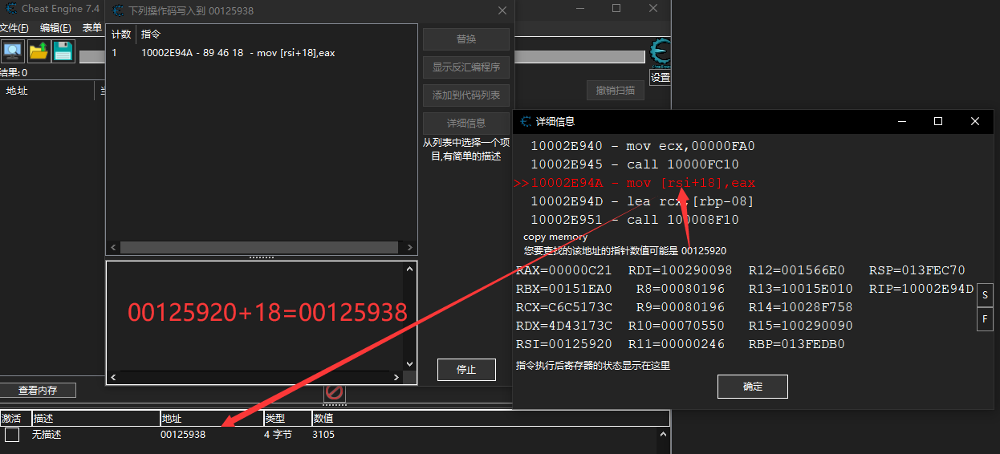

一、数值查找

扫描类型：

| 扫描类型                       | 说明                     |
| ------------------------------ | ------------------------ |
| 精确数值                       | 整形且明确               |
| 值大于、值小于、值介于         | 范围查询                 |
| 增加的值、减少的值、变动的数值 | 有变化                   |
| 增加了。。、减少了。。、       | 需要知道明确增减变化的量 |
| 未变动的数值                   | （重复 - 会自动扫描）    |
| 对比首次扫描                   |                          |

数值类型：

| 类型   | 说明 |
| ------ | ---- |
| 字节   |      |
| 2 字节 |      |
|        |      |

二、多级指针

1. 手动查询

   先查询出数值地址，右键-是什么改写了这个地址，回到进程改变数值，回到CE中，观察到有记录上级地址，记录下offSet后续会用到。

   

   未完。。。。。

   

   REF：

   https://www.bilibili.com/video/BV1GY411J7hy?t=1127.8（推荐）

   https://www.bilibili.com/video/BV1nR4y1u7PZ?t=2546.1

   

2. 自动查询-指针扫描（推荐）

   先查询出数值地址，右键->对这个地址进行指针扫描，默认级别7、保存扫描结果到磁盘中。
   重载游戏或者改变指针，再次查询出数值地址，双击复制二次地址，回到指针扫描器中，菜单-指针扫描器-重新扫描内存（快捷键CTRL+R），输入新地址，保存扫描结果到磁盘中，即可找到全局变量段的根指针，双击即可添加到地址列表中，双击地址列也可以看到全路径。

3. 自动查询-指针映射（推荐）
   1. 查询出数值地址A，右键->生成指令映射集AF
   2. 变更游戏指针，查询出新数值地址B，右键->对这个地址进行指针扫描，勾选中“与其它保存的结果相比对”加载AF文件，并选择地址A，确定。
   3. 扫描器较少选项时，可直接变更游戏指针，并直接观察出实际调用链。
   4. 或者步骤2后续，（快捷键CTRL+R）弹出窗口中，选中要查找的数值，输入新的数值，也可以过滤定位。