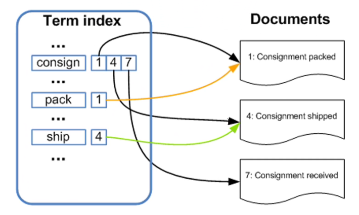

# 初识  Elasticsearch

## 概念和适用场景

**KeyWord**：分步式、海量数据、全文检索、准实时快速、Restful

### Database VS Elasticsearch

| Database | ES       |
| -------- | -------- |
| 库       | Index    |
| Table    | Type     |
| Row      | Document |
| Column   | Field    |
| Schema   | Mapping  |

Tip：Es6 之后推荐尽量在一个 index 只有一个 type。

MySQL：`select * from user.user_info where name = '张三' ;`
ES：`GET /user/user_info/_search?q=name:张三`

## 倒排索引



[倒排索引 | Elasticsearch: 权威指南 | Elastic](https://www.elastic.co/guide/cn/elasticsearch/guide/current/inverted-index.html)
[倒排索引 - fly1988happy - 博客园 (cnblogs.com)](https://www.cnblogs.com/fly1988happy/archive/2012/04/01/2429000.html)
[ElasticSearch 学习笔记（一）：倒排索引（Inverted index）_CrankZ的博客-CSDN博客](https://blog.csdn.net/CrankZ/article/details/80615789)

# ES 的安装配置

略

# 使用 PostMan、Kibana 操作ES

略

CRUD

简单搜索、

分词搜索

```shell
# =========== 分词 =========== 
# 分词-内置（垃圾）
GET _analyze
{
  "analyzer": "standard",
  "text": "我是中国人"
}

# 分词-IK（推荐）
# ik_smart
GET _analyze
{
  "analyzer": "ik_smart",
  "text": "我是中国人"
}
# ik_max_word
GET _analyze
{
  "analyzer": "ik_max_word",
  "text": "我是中国人"
}
# 自定义词语，添加到main.dic
GET _analyze
{
  "analyzer": "ik_max_word",
  "text": "灞波儿奔"
}
```

must、should

# ES 与数据库同步

- 全量
- 增量
  - 基于触发器
  - 基于业务记录时间
  - 开源中间件 mysql - binlog 订阅 alibaba/canal、go-mysql-elasticsearch
  - 官方 - logstash （基于id、time）

REF：[logstash全量、增量同步解决方案，Springboot + ElasticSearch 构建博客检索系统教程-慕课网 (imooc.com)](https://www.imooc.com/video/19953)

Tip：`select * from table_name where update_time >= sql_last_value and update_time < NOW() order by update_time desc;`  

# 分词介绍

ik

# 与 Spring 集成

## 依赖

pom.xml

## 配置

```yaml
##########################
### elasticsearch配置  ###
##########################
spring:
  data:
    elasticsearch:
      cluster-name: elasticsearch
      cluster-nodes: 127.0.0.1:9300
```

