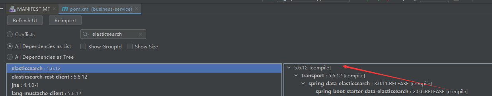
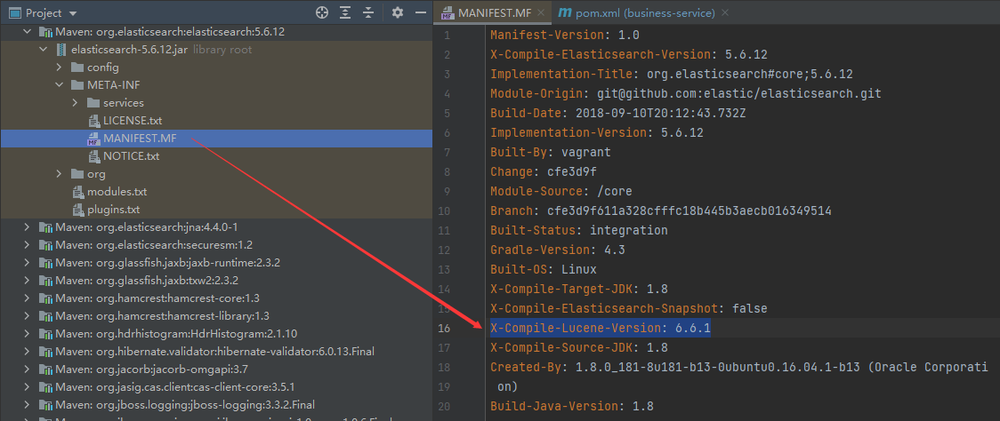
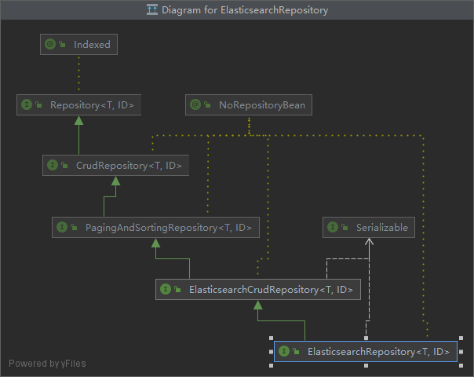

# Elasticsearch

Elasticsearch 是一个分布式、RESTful 风格的搜索和数据分析引擎，能够解决不断涌现出的各种用例。作为 Elastic Stack 的核心，它集中存储您的数据，帮助您发现意料之中以及意料之外的情况。

## 1、下载&安装

下载地址：[https://www.elastic.co/cn/downloads](https://www.elastic.co/cn/downloads/)

运行环境要求 JDK8 以后版本。

解压后，运行 %elasticsearch_home%\bin\elasticsearch.bat，访问 http://localhost:9200 能正常打开。

**win服务管理：**

| 命令                              | 描述     |
| --------------------------------- | -------- |
| elasticsearch-service.bat install | 安装     |
| elasticsearch-service.bat remove  | 卸载     |
| elasticsearch-service.bat manager | gui 管理 |

**config 配置：**

jvm.options           ==> 配置 JVM，比如内存参数等。

elasticsearch.yml  ==> 配置 Elasticsearch 信息，比如默认服务端口等。
\# 允许跨域
`http.cors.enabled: true`
\#  Access-Control-Allow-Origin 响应头指定了该响应的资源是否被允许与给定的[origin](https://developer.mozilla.org/zh-CN/docs/Glossary/Origin)共享。
`http.cors.allow-origin: "*"`

## 2、插件安装

### elasticsearch-analysis-ik 分词器

下载地址：[https://github.com/medcl/elasticsearch-analysis-ik](https://github.com/medcl/elasticsearch-analysis-ik)，注意与ES版本一致。

安装：解压到 %elasticsearch_home%\\plugins\ik 目录，ik为自己命名目录，重启ES生效。

IK词库配置：%elasticsearch_home%\\plugins\ik\config\IKAnalyzer.cfg.xml

### elasticsearch-head 管理端

下载地址：[https://github.com/mobz/elasticsearch-head](https://github.com/mobz/elasticsearch-head)

#### Running with built in server

- `git clone git://github.com/mobz/elasticsearch-head.git`
- `cd elasticsearch-head`
- `npm install`
- `npm run start`
- `open` http://localhost:9100/

# Kibana

Kibana 是一个免费且开放的用户界面，能够让您对 Elasticsearch 数据进行可视化，并让您在 Elastic Stack 中进行导航。您可以进行各种操作，从跟踪查询负载，到理解请求如何流经您的整个应用，都能轻松完成。


下载地址：[https://www.elastic.co/cn/downloads/kibana](https://www.elastic.co/cn/downloads/kibana)，注意与ES版本一致。

REF：

# Spring 整合

与es版本兼容关系：[Spring Data Elasticsearch - Reference Documentation](https://docs.spring.io/spring-data/elasticsearch/docs/current/reference/html/#preface.versions)

|                  Spring Data Release Train                   |                  Spring Data Elasticsearch                   | Elasticsearch | Spring Framework | Spring Boot |
| :----------------------------------------------------------: | :----------------------------------------------------------: | :-----------: | :--------------: | :---------: |
|                       2021.0 (Pascal)                        |                            4.2.1                             |    7.12.1     |      5.3.7       |    2.5.x    |
|                       2020.0 (Ockham)                        |                            4.1.x                             |     7.9.3     |      5.3.2       |    2.4.x    |
|                           Neumann                            |                            4.0.x                             |     7.6.2     |      5.2.12      |    2.3.x    |
|                            Moore                             |                            3.2.x                             |    6.8.12     |      5.2.12      |    2.2.x    |
| Lovelace[[1](https://docs.spring.io/spring-data/elasticsearch/docs/current/reference/html/#_footnotedef_1)] | 3.1.x[[1](https://docs.spring.io/spring-data/elasticsearch/docs/current/reference/html/#_footnotedef_1)] |     6.2.2     |      5.1.19      |    2.1.x    |
| Kay[[1](https://docs.spring.io/spring-data/elasticsearch/docs/current/reference/html/#_footnotedef_1)] | 3.0.x[[1](https://docs.spring.io/spring-data/elasticsearch/docs/current/reference/html/#_footnotedef_1)] |     5.5.0     |      5.0.13      |    2.0.x    |
| Ingalls[[1](https://docs.spring.io/spring-data/elasticsearch/docs/current/reference/html/#_footnotedef_1)] | 2.1.x[[1](https://docs.spring.io/spring-data/elasticsearch/docs/current/reference/html/#_footnotedef_1)] |     2.4.0     |      4.3.25      |    1.5.x    |





下面以 Item 为例子。

YML

```yaml
##########################
### elasticsearch配置  ###
##########################
spring:
  data:
    elasticsearch:
      cluster-name: elasticsearch
      cluster-nodes: 127.0.0.1:9300
```

POJO

```java
@Document(indexName = "item", type = "docs", shards = 1, replicas = 0)
@Data
public class Item {
    @Id
    Long id;
    
    /**
     *  标题
     */
    @Field(type = FieldType.Text, analyzer = "ik_max_word")
    String title;
    
    /**
     *  分类
     */
    @Field(type = FieldType.Keyword)
    String category;
}
```

Repository

```java
public interface ItemRepository extends ElasticsearchRepository<Item,Long> {
}
```



调用处

```java
@Autowired
private ItemRepository repository;

// 新增记录
Item item = new Item();
// ...
repository.save(item);

// 查询
QueryBuilder queryBuilder = QueryBuilders.matchQuery("category", "手机");
repository.search(queryBuilder)

```


REF：
[Spring Data Elasticsearch 用户指南 - 简书 (jianshu.com)](https://www.jianshu.com/p/27e1d583aafb)
[Spring Data Elasticsearch_小试牛刀_JunsIr的技术栈-CSDN博客](https://blog.csdn.net/JunSIrhl/article/details/106067186)

