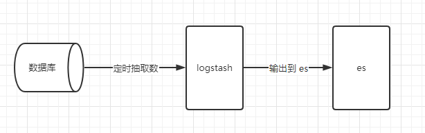

# logstash增量同步数据




一、添加MySQL数据库驱动
通过 https://mvnrepository.com/artifact/mysql/mysql-connector-java 搜索下载数据库相应版本jar。
存放目录
`%logstash_home%\lib\`

二、同步插件（默认已有，可忽略）

```sh
%logstash_home%/bin/logstash-plugin install logstash-input-jdbc
%logstash_home%/bin/logstash-plugin install logstash-output-elasticsearch
```

三、同步信息配置

创建文本文件 `%logstash_home%\config\tb_pro_info.conf` （可按同步表命名）

配置内容

```sh
input {
  jdbc {
    jdbc_driver_library => "D:/Program/logstash-6.6.1/lib/mysql-connector-java-8.0.26.jar"
    jdbc_driver_class => "com.mysql.cj.jdbc.Driver"
    jdbc_connection_string => "jdbc:mysql://120.79.171.153:3306/jjxmgl?useUnicode=true&characterEncoding=utf-8&useSSL=false&serverTimezone=Asia/Shanghai&allowPublicKeyRetrieval=true"
    jdbc_user => "jjxmgl"
    jdbc_password => "jjxmgl123"
    
    # 定时计划
    schedule => "* * * * *"
    statement => "select `ID`, STR_TO_DATE(t.last_modified_time, '%Y%m%d%H%i%s') as `LAST_MODIFIED_TIME` from tb_pro_info t where STR_TO_DATE(t.last_modified_time, '%Y%m%d%H%i%s') >= :sql_last_value"
    use_column_value => true
    tracking_column_type => "timestamp"
    tracking_column => "last_modified_time"
    # 将最后运行时间信息保存到磁盘，默认保存到 \bin 目录下
    last_run_metadata_path => "syncTime_pro_info"
  }
}


output {
    elasticsearch {
        # ES的IP地址及端口
        hosts => ["127.0.0.1:9200"]

        # 索引名称 可自定义
        index => "project"

        # 需要关联的数据库中有有一个id字段，对应类型中的id
        document_id => "%{id}"
        
        # 类型
        document_type => "pro_info"
    }
    stdout {
        # JSON格式输出
        codec => json_lines
    }
}
```

说明：

jdbc_*：数据库信息

schedule：定时计划配置

statement：查询语句（因为 logstash 当前只支持时间戳、长整型两种数据类型，这里需要额外函数转换）

tracking_column_type：指定版本字段的数据类型

tracking_column：指定版本字段名

last_run_metadata_path：版本信息输出文件


REF：

[Jdbc input plugin | Logstash Reference 6.6](https://www.elastic.co/guide/en/logstash/6.6/plugins-inputs-jdbc.html)

[利用logstash将mysql多表数据增量同步到es](https://www.jianshu.com/p/2abcd6892c31)

