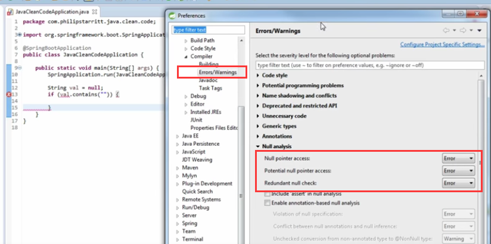
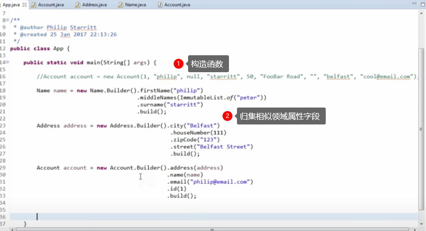

# [Clean Code](https://www.youtube.com/playlist?list=PLiwhu8iLxKwL-VOcGAPzaflFIRFXwUxDD)

## 0# How to comment code - Base practices

1、写明为什么这么做，（译者意见：简要地写）写做了什么。

2、不要什么都写；don't comment everything，良好的函数、参数命名。[Self-documenting code](https://en.wikipedia.org/wiki/Self-documenting_code)

3、适应团队DOC风格。

4、记得代码变更时，一并更新注释。

## #1 - Eclipse Compiler Build Errors & Warnings Preferences



1、将可能的错误定位为ERROR，避免写错误代码，并与团队共享。

## #2 - Static Analysis FindBugs Eclipse Plugin Setup

1、FindBugs插件，静态分析代码。

## #3 - Builder Design Pattern Example

Builder模式

1、旧模式使用构造函数，传入的参数不明确意义。

```java
new Account(1, "name", "地址", null, ....... 50); // 传入的参数意义不明。
```

2、归集相似属性到不同领域中。

3、使用该模式能提升代码可读性。



## #4 - Avoid Boolean Parameters (Flag Arguments)

boolean参数，just have a think why is that bad 

因为你得通过查看API、原函数参数名才能知道，参数做什么用。

举例：

```java
doucumentService.checkIn(doc, true);
checkIn (doc, flag) {
	if (flag=Major) 做主版本的事
	else (flag=Minor) 做次版本的事
}
```

改成

```java
doucumentService.checkInMajorVersion(doc);
doucumentService.checkInMinorVersion(doc);
```

评论：

hmm, i guess java does no support variable naming in function calls. 
like `Checkin(filename="file.pdf",isMajorVersion=True);` 
This entire thing could have been avoided. Java being java i suppose. 
The new solution just moves the condition checking outside the function call. 
I think I even prefer the enum solution for readability while keeping the condition checking inside the function `Checkin("file.pdf",some_version_enum.MAJOR)`;

（译者：这个例子不好）

## #5 - Comparing String Constants

使用不是NULL值去跟变量比对，因为变量有可能为空。

```java
String str = "字串";
str.equals("常量");
```

改成

```java
"常量".equals(str);
```


## #6 - Exception Handling - Prefer Runtime Exceptions

1、旧时代，人们不管什么错误（译者：屎）都往外面抛，并指望调用方会正常的处理。
但通常调用方的做法是

1. 调用方catch后 `e.printStackTrace();` 就完事（译者：简称吃屎）。
2. 调用方接着再向外传递错误 `throw e;`。
3. 调用方根据不try，直接 `add throws declaration` 。

2、新时代，推荐使用 runtime exception，举例如 spring framework 的 [NestedRuntimeException (Spring Framework 5.3.8 API)](https://docs.spring.io/spring-framework/docs/current/javadoc-api/org/springframework/core/NestedRuntimeException.html)。

（译者，不太明白好处）

## #7 - Exception Handling - Throw Exceptions Instead of returning Error Lists

作者观点：使用抛出错误来替代错误列表返回。
作者意见，使用错误列表有如下问题

1. 调用方必须立即处理调用结果，并迫使调用方多了处理错误的代码使得代码可读性变差。
2. 如果是错误列表（或者其它结构体）必需考虑返回的对象是否为空、大小判断等。

（译者：不同意，甚至想反驳）

## #8 - How long should a method be??

**函数体应该多长？？**

一个类或者方法过长的时候，读者总是很崩溃的。
简单地把方法、类和职责拆细，往往会有立竿见影的成效。以类为例，拆分的维度有很多，常见的是横向／纵向。
例如，如果一个service，处理的是跟一个库表对象相关的所有逻辑，横向拆分就是根据业务，把建立／更新／修改／通知等逻辑拆到不同的类里去；
而纵向拆分，指的是把数据库操作/MQ操作/Cache操作/对象校验等，拆到不同的对象里去，让主流程尽量简单可控，让同一个类，表达尽量同一个维度的东西。

**让相同长度的代码段表示相同粒度的逻辑**

```java
public void doSomeThing(Map params1,Map params2){
	Do1 do1 = getDo1(params1);
	Do2 do2 = new Do2();
	do2.setA(params2.get("a"));
	do2.setB(params2.get("b"));
	do2.setC(params2.get("c"));
	mergeDO(do1,do2);
}
private void getDo1(Map params1){...};
private void mergeDo(do1,do2){...};
```

改成如下：

```java
public void doSomeThing(Map params1,Map params2){
	Do1 do1 = getDo1(params1);
	Do2 do2 = getDo1(params2);
	mergeDO(do1,do2);
}
private void getDo1(Map params1){...};
private void getDo2(Map params1){...};
private void mergeDo(do1,do2){...};
```

## #9 - STOP Writing Code!!!

使用轮子吧，不要造轮子了。

## #10 – AVOID Static Methods

作者观点

1、i don't like them, the main reason is that they are hard to test hard to mock.

2、。。。没听懂

（译者抄一句：[摸摸你的良心问自己，即使没有构造对象，调用这个方法仍有意义吗？如果是的话，那应该定义成静态方法。](https://stackoverflow.com/questions/2671496/when-to-use-static-methods) ）

## #11 – DRY Principle - Don't Repeat Yourself

著名 ~~干燥~~  原则（微笑.jpg）。

（译者：想想各种工具类是怎么来的）

## #12 – Please Write Unit Tests, lets go FAST!

1、为你编写的任何公共方法写对应的单元测试及套件。

2、测试能方便再次验证程序结果、边界等。

## #13 – Hero & God Methods!

1、stop adding to huge methods

2、。。。。

------

译者：hongjunjie