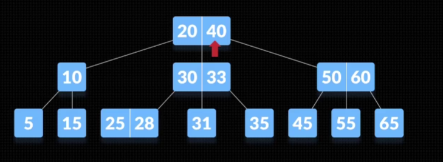

# Tree

## 树

定义概念：root、树干、树叶、N叉树（几个分叉）

二叉树、左子树、右子树

树高度：root 到最远叶子所经过的节点个数

[先序遍历](https://baike.baidu.com/item/%E5%85%88%E5%BA%8F%E9%81%8D%E5%8E%86)也叫做[先根遍历](https://baike.baidu.com/item/先根遍历)、[前序遍历](https://baike.baidu.com/item/前序遍历)，可记做根左右

A、B、D、E、C、F

中序遍历：左根右

D、B、E、A、F、C

通过二分查找，一次次排除一半的数据，但是如果数据单边较大，效果不理想，趋近于On

所以期望树的左右节点高度不相差1。

## 平衡树

高度相差不超过1，查找复杂度 O(long n)

但维护一棵树成本很大，左旋、右旋，因为树的节点多，无法一次读入内存，需要读盘多次 IO 浪费时间。

思路：降低树的高度，扩大节点只能包含一个元素的限制（即至少一个节点，可多个节点）

## B树

## B+树

Q：遍历叶子时，可能需要多次经过相同节点，如何解决？

A：节点不保存数据，只有判断信息，叶子才保存数据，头尾叶子通过单向、双向链表联接。
适用于范围查找、顺序查找。

