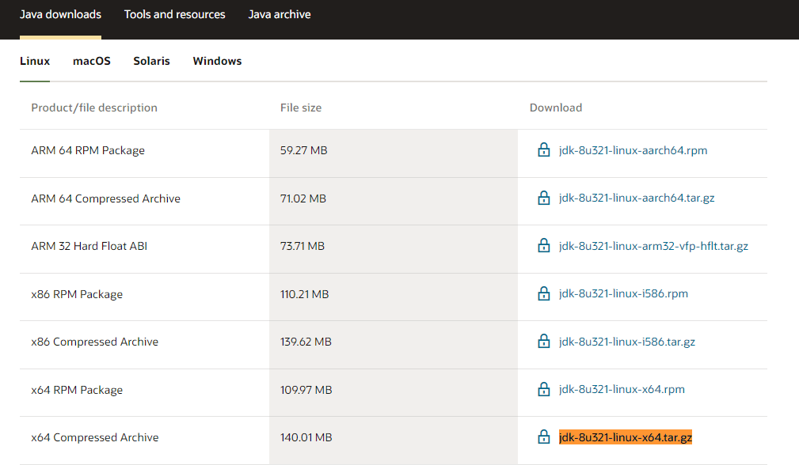

# CentOS 7  安装 Oracle JDK 环境

0、卸载原有openJDK

```shell
yum list installed openJDK
yum -y remove 上面找到的JDK名称一般有成对出现
```


1、下载Oracle JDK

[Java Downloads | Oracle](https://www.oracle.com/java/technologies/downloads/#java8)

选择 Compressed Archive 解压即可用。



2、安装

创建程序安装目录

```shell
mkdir /usr/local/java/
```

解压到安装目录

```shell
tar -xvf jdk-8u321-linux-x64.tar.gz -C /usr/local/java/
```

3、设置环境变量

```shell
vim /etc/profile
```

在文件尾部添加

```shell
export JAVA_HOME=/usr/local/java/jdk1.8.0_321
export JRE_HOME=${JAVA_HOME}/jre
export CLASSPATH=.:${JAVA_HOME}/lib:${JRE_HOME}/lib
export PATH=${JAVA_HOME}/bin:$PATH
```

使变量马上生效

```shell
source /etc/profile
```

添加软链接

```shell
ln -sf /usr/local/java/jdk1.8.0_321/bin/java /usr/bin/java
```

4、验证

```shell
java -version
```

打印出版本信息即可。


REF：[CentOS 7 安装 JAVA环境（JDK 1.8） - 云+社区 - 腾讯云 (tencent.com)](https://cloud.tencent.com/developer/article/1341059)