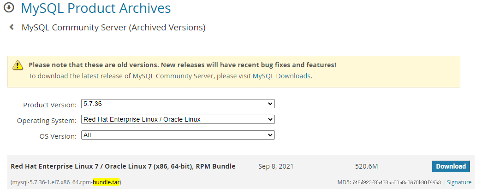

# CentOS 7  安装 MySQL5.7 通过RPM包

0. 卸载原有mariadb

```shell
# 列出原有安装包名
rpm -qa|grep mariadb
rpm -e --nodeps 包名 # 好比 rpm -e --nodeps mariadb-libs-5.5.68-1.el7.x86_64
# 同理，也一并检查 mysql
rpm -qa|grep mysql
rpm -e --nodeps 包名

# 删除其它配置文件
rm -rf /etc/my.cnf
rm -rf /var/lib/mysql/
```

1. 下载

[MySQL :: Download MySQL Community Server (Archived Versions)](https://downloads.mysql.com/archives/community/)

页面搜索 bundle.tar 选择对应操作系统、对应版本，如下 



2. 安装

```shell
# 解压
tar -xvf mysql-5.7.36-1.el7.x86_64.rpm-bundle.tar
# 按顺序安装
rpm -ivh mysql-community-common-5.7.36-1.el7.x86_64.rpm
rpm -ivh mysql-community-libs-5.7.36-1.el7.x86_64.rpm
rpm -ivh mysql-community-devel-5.7.36-1.el7.x86_64.rpm
rpm -ivh mysql-community-libs-compat-5.7.36-1.el7.x86_64.rpm
rpm -ivh mysql-community-client-5.7.36-1.el7.x86_64.rpm
rpm -ivh mysql-community-server-5.7.36-1.el7.x86_64.rpm

```

3. 启动服务

```shell
# 自启动服务
service enable mysqld
# 启动服务
systemctl start mysqld
# 查看服务
service mysqld status
# 验证查看版本
mysql --version
```

4. 修改密码

```shell
# 查看原始密码
more /var/log/mysqld.log |grep password
mysql -uroot -p
# 输入原始密码后进入mysql命令状态
```

mysql命令状态下：

```mysql
# 提示 ERROR 1819 (HY000): Your password does not satisfy the current policy requirements 时，
# 可先执行如下脚本，再重新设置密码
set global validate_password_policy=0;
set global validate_password_length=1;

# 修改密码
SET PASSWORD FOR 'root'@'localhost'="新密码";

# 修改远程可访问
mysql> update mysql.user set host='%' where user='root';
# 第二种方式：grant all privileges on *.* to root@'%' identified by "password";

# 刷新权限
mysql> flush privileges;

```

5. 配置防火墙

```shell
firewall-cmd --zone=public --add-port=3306/tcp --permanent
```

6. 调整配置

配置文件默认路径：/etc/my.cnf

7. 密码重置方法

   ```shell
   vim /etc/my.cnf
   ```

   在[mysqld]后添加 `skip-grant-tables`（登录时跳过权限检查）

   重启服务 `sudo systemctl restart mysqld` ，

   ```shell
   # 登陆时不输入密码，直接回车
   mysql –uroot –p    
   # 先刷新
   flush privileges;
   GRANT ALL PRIVILEGES ON *.* TO 'root'@'%'IDENTIFIED BY 'root新密码' WITH GRANT OPTION;
   flush privileges;
   ```

   记得改回 my.cnf 配置，重启服务即可。
