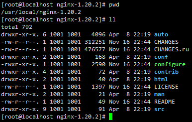

# CentOS 7  源码编译安装 Nginx

1、下载

[nginx: download](https://nginx.org/en/download.html)

一般选择最新的 Stable version 进行安装。

```
wget https://nginx.org/download/nginx-1.20.2.tar.gz
```

2、安装

提前安装依赖包

```shell
yum -y install gcc zlib zlib-devel pcre pcre-devel openssl openssl-devel
```

解压安装包

```shell
tar xvf nginx-1.20.2.tar.gz
```

进入解压出来包目录中

```
cd nginx-1.20.2
```



简化版本

```shell
# 配置
./configure
# 编译
make && make install
```

配置版本

```shell
# 下面这段配置需要修整成单行
./configure 
	--prefix=/usr/local/nginx
	--sbin-path=/usr/local/nginx/nginx 
	--conf-path=/usr/local/nginx/nginx.conf 
	--pid-path=/usr/local/nginx/nginx.pid
	--with-http_gzip_static_module
make && make install
```

3、启动服务

```shell
vi /etc/systemd/system/nginx.service
```

输入以下内容

```ini
[Unit]
Description=nginx service
After=network.target

[Service]
Type=forking
ExecStart=/usr/local/nginx/sbin/nginx
ExecReload=/usr/local/nginx/sbin/nginx -s reload
ExecStop=/usr/local/nginx/sbin/nginx -s quit
PrivateTmp=true

[Install]
WantedBy=multi-user.target
```

4、常用指令

```shell
systemctl enable nginx
systemctl start nginx.service
systemctl restart nginx.service
systemctl status nginx.service
systemctl disable nginx.service

# 不重启应用，重新加载配置
/usr/local/nginx/sbin/nginx -s reload
```

5、配置防火墙

```shell
firewall-cmd --zone=public --add-port=端口号/tcp --permanent
```


REF：[Building nginx from Sources](https://nginx.org/en/docs/configure.html)

[nginx: Linux packages](https://nginx.org/en/linux_packages.html#RHEL-CentOS)
