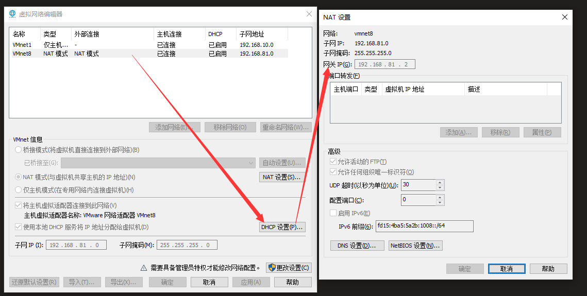
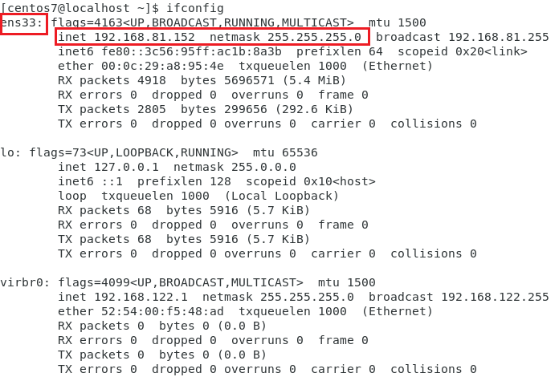
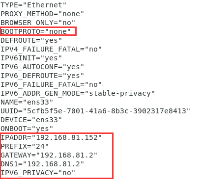

# Vmware 网络 NAT 方式设置固定IP（Linux）

1、查看NET方式网关信息

菜单 - 编辑 - 虚拟网络编辑器 - 选中 VMnet8 (NAT模式) ，点击 NAT 设置



 

2、修改虚拟机内操作系统（本例以CentOS7做演示）

先检查下本机IP

```shell
ifconfig
```



修改本机IP配置，文件名依据上图 ifcfg-en33

```shell
vi /etc/sysconfig/network-scripts/ifcfg-ens33
```



调整内容为对应步骤1查出的网关信息

```shell
BOOTPROTO="none"

IPADDR="192.168.81.152"
PREFIX="24"
GATEWAY="192.168.81.2"
DNS1="192.168.81.2"
IPV6_PRIVACY="no"
```

