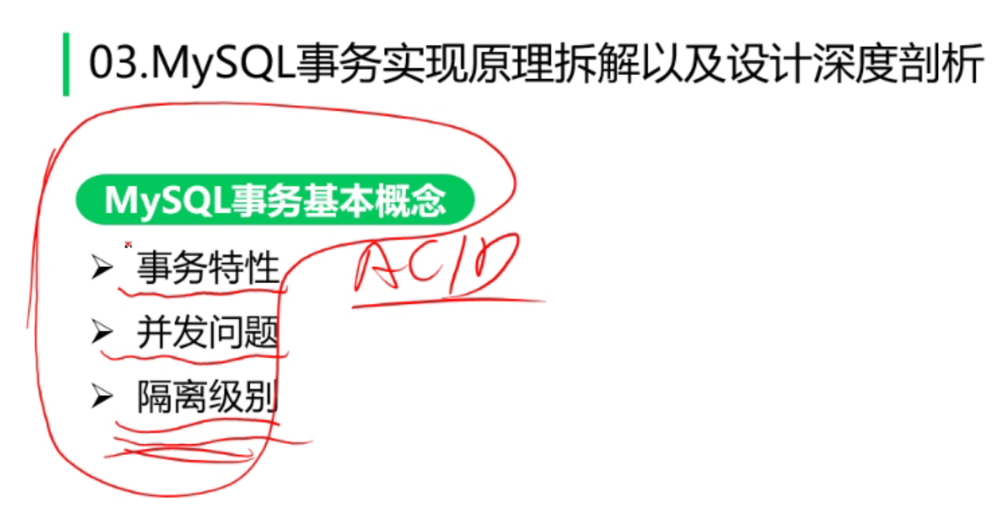

# 存储引擎

MySQL记录存储

- 页头
  - 记录页面的控制信息，共占56字节，包括页的左右兄弟页面指针、页面空间使用情况等。
- 虚记录
  - 最大虚记录:比页内最大主键还大
  - 最小虚记录:比页内最小主键还小
- 记录堆
  - 行记录存储区，分为有效记录和已删除记录两种
- 自由空间链表
  - 已删除记录组成的链表
- 未分配空间
  - 页面未使用的存储空间; 
- Slot区
- 页尾
  - 页面最后部分，占8个字节，主要存储页面的校验信息;

页内记录维护

1. 顺序保证
   - 物理有序？（错误）
   - 逻辑有序！（打勾）
2. 插入策略
   - 自由空间链表
   - 未使用空间
3. 页内查询
   - 遍历？       （错误）
   - 二分查找！（打勾）

表空间收缩（空洞碎片清理）--解决方法：迁移数据，等于重新顺序插数据。

## InnoDB 内存管理

1. 取分配内存 - 内存池（整块内存）

2. 内存页面管理

   1. 页面映射
   2. 页面数据管理 - 脏面

3. 数据淘汰

   1. 内存页都被使用

   2. 淘汰策略

      1. LRU 最久没被使用：使用链表，缺点？加载了大数据（比如全表扫描）导致内存污染？？？

         

         

      2. LFU 中点插入法

   

   

# 锁实现

# 事务实现原理拆解

事务特性

- A
- C
- I
- D

并发问题

- 脏读(Drity Read)：读取到未提交的数据
- 不可重复读(Non-repeatable read)：两次读取结果不同
- 幻读(Phantom Read)：select 操作得到的结果所表征的数据状态无法支撑后续的业务操作

隔离级别

- Read Uncommitted (读取未提交内容)：最低隔离级别，会读取到其他事务未提交的数据，脏读; 
- Read Committed (读取提交内容)：事务过程中可以读取到其他事务已提交的数据，不可重复读;
- Repeatable Read (可重复读)：每次读取相同结果集，不管其他事务是否提交，幻读;
- Serializable (串行化)：事务排队，隔离级别最高，性能最差;

**MVCC！！！**

- 可见性判断
  - 创建快照这一刻，还未提交的事务;
  - 创建快照之后创建的事务;
- Read View
  - 快照读活跃事务列表
  - 列表中最小事务ID
  - 列表中最大事务ID

**undo log**

- 回滚日志
- 保证事务原子性
- 实现数据多版本-LSM
- delete undo log：用于回滚，提交即清理；
- update undo log：用于回滚，同时实现快照读，

**redo log**

实现事务的持久性

- 记录修改
- 用于异常恢复
- 循环写文件
  - write pos：写入位置
  - Check Point：刷盘位置
  - Check Point -> Write Pos

