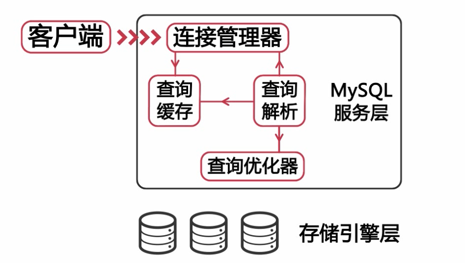
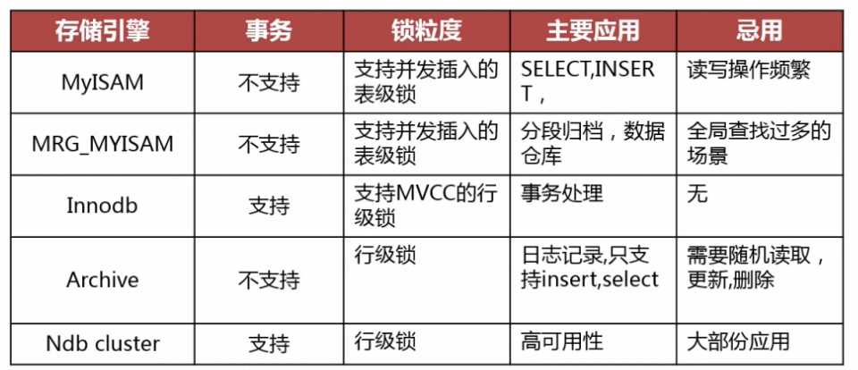
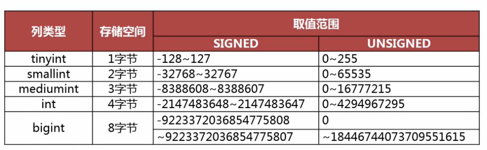

# MySQL.慕课网.打造扛得住的MySQL数据库架构


## 第01章 实例和故事

web服务器扩容比较容易，数据库扩展难。

旧数据库架构：Master (1) --> Slave (N)，带来的问题：恢复难、网卡压力大。

性能指标：QPS、TPS、并发量（并发量 != 连接数）、CPU、内存、磁盘IO

### 大促中影响因素：

* SQL查询速度 （效率低下的SQL影响QPS、TPS）

* 磁盘IO（使用更快的磁盘设备、调整消耗磁盘性能的任务）

* 服务器硬件（大量的并发带来最大的挑战）
* 网卡流量（减少从服务器的数量-多级同步？、进行分级缓存、避免使用select *进行查询、分离数据库网络、业务网络-换句话说数据库单独）

### 大表带来的问题：

什么叫大表

* 记录行数巨大，单表超过千万行
* 表数据文件巨大、表数据文件超过10G

影响：

* 查询慢
* 建立索引需要很长时间
* 造成长时间的主从延迟
* 影响正常的数据操作

如何处理大表

分库分表：

* 分表主键的选择
* 分表后跨分区数据的查询和统计

大表的历史数据归档：

* 归档时间点的选择
* 如何进行归档操作

实现：1分区表，2区分当前业务表、历史表

### 大事务带来的问题

什么是事务：原子性、一致性、隔离性、持久性

风险：锁定太多的数据，造成大量的阻塞和锁超时；回滚所需时间比较长；执行时间长，主从延迟

处理：避免一次处理太多的数据，分次提交；移除事务中不必要的select操作；


## 第02章 什么影响了MySQL性能

### 总概

1. 服务器硬件

2. 服务器系统

3. 数据库存储引擎的选择
4. 数据库参数配置
5. 数据库结构设计和 SQL 语句

### CPU：

从应用上看区分是否 CPU 密集型；考虑 MySQL 是否支持多 CPU 并发处理；系统的并发量；

如果是web类应用，CPU的核心数量比频率重要；MySQL 的版本；

内存：容量越大越好（考虑到 InnoDB 索引、数据都会缓存到内存中），但对性能影响有一定限度并不能无限的增加性能。

### 磁盘：

传统磁盘：存储空间大、价格低、读写速度慢、使用量最多、最常见

RAID：磁盘冗余队列

| 等级   | 特点               | 是否冗余 | 盘数 | 读   | 写             |
| ------ | ------------------ | -------- | ---- | ---- | -------------- |
| RAID0  | 便宜，快速，危险   | 否       | N    | 快   | 快             |
| RAID1  | 高速读，简单，安全 | 有       | 2N   | 快   | 慢             |
| RAID5  | 安全，成本折中     | 有       | N+1  | 快   | 取决于最慢的盘 |
| RAID10 | 贵，调整，安全     | 有       | 2N   | 快   | 快             |

### CentOS系统参数优化

##### 内核相关参数(/etc/sysctl.conf)

```ini
net.core.somaxconn=65535
net.core.netdev_ max_ backlog= 65535
net.ipv4.tcp_ max_ _syn_ backlog= 65535

net.ipv4.tcp_fin_timeout = 10
net.ipv4.tcp_tw_reuse = 1
net.ipv4.tcp_tw_recycle = 1

net.ipv4.tcp_keepalive_time = 120
net.ipv4.tcp_keepalive_intvl = 30
net.ipv4.tcp_keepalive_.probes = 3

kernel.shmmax = 4294967295
```

##### 增加资源限制(/etc/security/imit.conf)

```ini
soft nofile 65535 
hard nofile 65535
```

\* 表示对所有用户有效
soft 指的是当前系统生效的设置
hard 表明系统中所能设定的最大值
nofile 表示所限制的资源是打开文件的最大数目
65535 就是限制的数量

##### 磁盘调度策略(/sys/block/devname/queue/scheduler)

查看

```sh
cat /sys/block/sda/queue/scheduler
```

修改

```sh
echo deadline > /sys/block/sda/queue/scheduler 
```

- noop(电梯式调度策略)
  NOOP实现了一个FIFO队列，它像电梯的工作方法一样对I/O请求进行组织 ，当有一个新的请求到来时，它将请求合并到最近的请求之后，以此来保证请求同一介质。NOOP倾向饿死读而利于写，因此NOOP对于闪存设备、RAM及嵌入式系统是最好的选择。

- deadline (截止时间调度策略)
  Deadline确保了在一个截止时间内服务请求，这个截止时间是可调整的，而默认读期限短于写期限。这样就防止了写操作因为不能被读取而饿死的现象，**Deadline对数据库类应用是最好的选择**。

- anticipatory (预料I/O调度策略)
  本质上与Deadline-样，但在最后一-次读操作后要等待6ms ，才能继续进行对其它I/O请求进行调度。它会在每个6ms中插入新的I/O操作，而会将一些小写入流合并成一个大写入流，用写入延时换取最大的写入吞吐量。AS适合于写入较多的环境，比如文件服务器。AS对数据库环境表现很差。

### 文件系统对性能的影响

EXT3/4系统的挂载参数( /etc/fstab)
data=writeback（推荐） | ordered | journal
noatime，nodiratime

```ini
/dev/sda1/ext4 noatime，nodiratime，data=writeback 1 1
```

### MySQL 体系结构




存储引擎很重要，但基本选择 InnoDB （本人觉得）。

### MySQL服务参数

##### 配置参数“后来居上”原则。

配置来源顺序：命令行参数、配置文件。
查看配置文件读取顺序
Linux；mysqld --help --verbose| grep -A 1 'Default options'
Windows：mysqld --help --verbose
Default options are read from the following files in the given order：
C：\WINDOWS\my.ini C：\WINDOWS\my.cnf C：\my.ini C：\my.cnf D：\Program\MySQL\MySQL80\my.ini D：\Program\MySQL\MySQL80\my.cnf 

##### 配置参数作用域：

- 全局参数
  set global 参数名 = 参数值;
  set @@global.参数名 ：= 参数值;
- 会话参数
  set [session] 参数名 = 参数值;
  set @@session.参数名 ：= 参数值;

##### 内存配置：

- 确定可以使用的内存的上限
- 确定 MySQL 的每个连接使用的内存：
  sort_buffer_size、join_buffer_size、read_buffer_size、read_rnd_buffer_size

[注意]需要为操作系统保留必要内存，强制建议数据库与应用分开。

缓存池

- Innodb_buffer_pool_size
  推荐大小：总内存-每个线程所需要的内存*连接数-系统保留内存，官方推荐总内存75%以上。

- key_buffer_size
  主要用于 MyIsam 引擎，系统表还使用 MyIsam 引擎，所以不能全关闭。

  ```sql
  select sum(index_length)
  from information_schema.tables where engine ='myisam'
  ```

##### I/O 相关配置

###### Innodb 相关

- [`innodb_log_file_size`](https：//dev.mysql.com/doc/refman/8.0/en/innodb-parameters.html#sysvar_innodb_log_file_size)

- [`innodb_log_files_in_group`](https：//dev.mysql.com/doc/refman/8.0/en/innodb-parameters.html#sysvar_innodb_log_files_in_group)

  事务日志总大小 = Innodb_log_file_in_group * Innodb_log_file_size
  因为写满一个事务日志文件才往下写另一个文件，所以没必要创建多个文件，只需要考虑文件大小。
  文件大小大概只需要考虑支持一个小时事物即可。

- [`innodb_log_buffer_size`](https：//dev.mysql.com/doc/refman/8.0/en/innodb-parameters.html#sysvar_innodb_log_buffer_size)
  事务缓存大小，正常1秒会刷新缓存到磁盘，32M~128M即可。

- [`innodb_flush_log_at_trx_commit`](https：//dev.mysql.com/doc/refman/8.0/en/innodb-parameters.html#sysvar_innodb_flush_log_at_trx_commit) = 2
  0：每秒进行一次 log 写入 cache，并 flush log 到磁盘。
  1[默认]：在每次事务提交时，执行log写入cache 并flush log到磁盘。缺点IO高。适用于强事务场景，金融类。
  2[建议]：每次事务提交，执行log数据写入cache，每秒执行一次flush log到磁盘。
- [`innodb_flush_method`](https：//dev.mysql.com/doc/refman/8.0/en/innodb-parameters.html#sysvar_innodb_flush_method) = O_DIRECT
  for Unix-like systems，不经过系统缓存。
- [`innodb_file_per_table`](https：//dev.mysql.com/doc/refman/8.0/en/innodb-parameters.html#sysvar_innodb_file_per_table) = Y
  为每个表创建单独的表空间。
- [`innodb_doublewrite`](https：//dev.mysql.com/doc/refman/8.0/en/innodb-parameters.html#sysvar_innodb_doublewrite) = Y
  是否启用双写缓冲区

##### 安全相关配置参数

- [`expire_logs_days`](https：//dev.mysql.com/doc/refman/8.0/en/replication-options-binary-log.html#sysvar_expire_logs_days)
  指定自动清理 binlog 的天数，推荐至少覆盖两个全备。
- [`max_allowed_packet`](https：//dev.mysql.com/doc/refman/8.0/en/server-system-variables.html#sysvar_max_allowed_packet)
  控制 MySQL 可以接收的包的大小，比如 32M，也控制主从复制使主从两者参数值一致。
- skip_name_resolve
  禁用DNS查找
- sysdate_is_now
  确保sysdate()返回确定性日期
- read_only
  禁止非super权限的用户写权限
- skip_slave_start
  禁用Slave自动恢复
- sql_mode
  设置MySQL所使用的SQL模式
  - strict_trans_tables
  - no_engine_subtitution
  - no_zero_date
  - no_zero_in_date
  - only_full_group_by

##### 其它常用配置参数

* sync_binlog
  控制 MySQL 如何向磁盘刷新 binlog，默认为 0 由系统控制。大于 0 时表示N次事务才写到磁盘中。
* tmp_table_size、max_heap_table_size
  控制内存临时表大小，一般设置两者相同，不建议太大可能造成内存溢出。
* max_connections
  控制允许的最大连接数，默认值可能太小按需要调整。

##### 数据库设计对性能的影响

- 过分的反范式化为表建立太多的列
- 过分的范式化造成太多的表关联
- 在OLTP环境中使用不恰当的分区表
- 使用外键保证数据的完整性

##### 总结

性能优化顺序：
1、数据库结构设计和SQL语句
2、数据库存储引擎的选择和参数配置
3、系统选择及优化
4、硬件升级

【dev-my.ini】

```ini
server_type=3
tmp_table_size=51M
myisam_sort_buffer_size=93M
```

【server-my.ini】

```ini
server_type=2
tmp_table_size=298M
myisam_sort_buffer_size=584M
```

【dedicated-my.ini】

```ini
server_type=1
tmp_table_size=853M
myisam_sort_buffer_size=3G
```


## 第03章 MySQL基准测试


## 第04章 MySQL数据库结构优化

### 数据库结构优化介绍

**良好的数据库逻辑设计和物理设计是数据库获得高性能的基础**

数据库结构优化的目的

* 减少数据冗余
  （仅尽量减少，必要的冗余是必需的）

* 尽量避免数据维护中出现更新，插入和删除异常
  插入异常：如果表中的某个实体随着另一个实体而存在
  更新异常：如果更改表中的某个实体的单独属性时，需要对多行进行更新
  删除异常：如果删除表中的某-实体则会导致其他实体的消失
* 节约数据存储空间
* 提高查询效率

### 数据库结构设计的步骤

* 需求分析：全面了解产品设计的存储需求
  * 存储需求
  * 数据处理需求
  * 数据的安全性和完整性

* 逻辑设计：设计数据的逻辑存储结构数据实体之间的逻辑关系，解决数据冗余和数据维护异常

* 物理设计：跟据所使用的数据库特点进行表结构设计
  关系型数据库：Oralce，SQLServer，MysqL，postgresSQL
  非关系型数据库：mongo，Redis，Hadoop
  存储引擎：Innodb
* 维护优化：跟据实际情况对索引、存储结构等进行优化

### 数据库设计范式

* 数据库设计的第一范式
  * 数据库表中的所有字段都只具有单一属性
  * 单一属性的列是由基本的数据类型所构成的
  * 设计出来的表都是简单的二维表

* 数据库设计的第二范式
  要求一个表中只具有一个业务主键，也就是说符合第二范式的表中不能存在非主键列对只对部分主键的依赖关系
* 数据库设计的第三范式
  指每一个非主属性既不部分依赖于也不传递依赖于业务主键，也就是在第二范式的基础上消除了非主属性对主键的传递依赖

### 物理设计

根据所选择的关系型数据库的特点对逻辑模型进行存储结构设计

涉及的内容

* 定义数据库、表及字段的命名规范

  * 数据库、表及字段的命名要遵守可读性原则
  * 数据库、表及字段的命名要遵守表意性原则
  * 数据库、表及字段的命名要遵守长名原则

* 选择合适的存储引擎

  

* 为表中的字段选择合适的数据类型

  当一个列可以选择多种数据类型时，应该**优先考虑数字类型**，其次是日期或二进制类型，最后是字符类型。
  对于相同级别的数据类型，应该**优先选择占用空间小**的数据类型。
  

  

  * **VARCHAR 的适用场景**
    存储特点：变长字符串，占用额外字节记录长度，使用最小的符合需求长度（MySQL 加载数据到内存中占用同列长度的大小空间）
    * 字符串列的最大长度比平均长度大很多
    * 字符串列很少被更新
    * 使用了多字节字符集存储字符串
  * CHAR 类型的适用场景
    * CHAR类型适合存储所长度近似的值
    * CHAR类型适合存储短字符串
    * CHAR类型适合存储经常更新的字符串列

* 建立数据库结构

Innodb 引擎表主键

* 主键应该尽可能的小
* 主键应该是顺序增长的
* Innodb的主键和业务主键可以不同


## 第05章 MySQL高可用架构设计

利用MySQL二进制日志进行主从复制，达到高可用。

二进制日志格式

binlog_ format=[STATEMENT|ROW|MIXED]

二进制日志格式：

* 段

  * 优点：记录量少，节省磁盘与网络IO
  * 缺点，可能造成主从数据不一致

* 行

  * 优点：主从复制更加安全，对每一行数据的修改比基于段的复制高效（作者：只记录单条记录的修改所以应用要比基于段更高效，加快主从复制的效率。这段话不理解。），因为是完整记录，所以恢复数据更加方便。

  * 缺点：记录量大。

    MySQL的改进

* 混合

  * 

## 第06章 数据库索引优化

### 什么是索引？

### 索引的作用，优缺点。

MySQL的索引是由存储引擎实现。

### 索引的类型 

B-tree、B+树


## 第07章 SQL查询优化


## 第08章 数据库的分库分表

### 8-1 数据库分库分表的几种方式

- 把一个实例拆分多个数据库到不同的实例中
- 把一个库中的表分享到不同的数据库中

### 8-2 数据库分片前的准备

- 如何选择分区键
  - 分区键要能尽量避免跨分片查询的发生（比如博客系统中按用户分片）
  - 分区键要能尽量使各个分片中的数据平均
- 如何存储无需分片的表
  - 每个分片中存储一份相同的数据 （需要分片之间数据一致性）
  - 使用额外的节点统一存储 （查询效率慢）
- 如何分配分片中的数据（方式）
  - 按分区键的 Hash 值取模来分配分片的数据 （需要合适的 Hash 算法）
  - 按分区键的范围来分配分片数据 （适用数值类型，缺点数据不平均，热点数据压力大）
  - 利用分区键和分片的映射表来分配分片数据（可能成为系统瓶颈）
- 如何生成全局唯一ID
  - 使用auto_increment_increment和auto_increment_offset参数
  - 使用全局节点来生成ID
  - 在Redis等缓存服务器中创建全局ID

### 8-3 数据库分片演示(上)

### 8-4 数据库分片演示(下)

## 第09章 数据库监控
