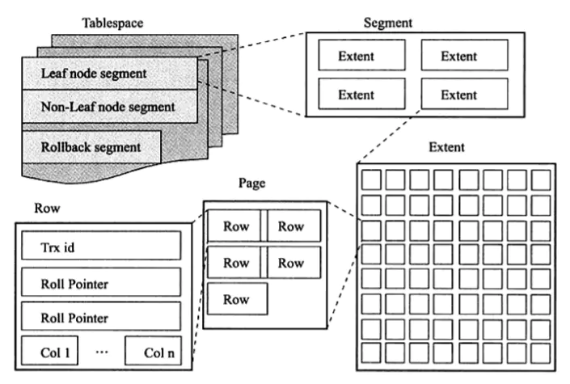

# 第1章 MySQL 体系结构和存储引擎

[Overview of MySQL Storage Engine Architecture](https://dev.mysql.com/doc/refman/8.0/en/pluggable-storage-overview.html)

- 连接池组件
- 脚本
- NoSQL接口组件
- SQL接口组件
- 查询分析组件
- 优化器组件
- 缓存组件
- 存储引擎
- 物理文件

# 第2章 InnoDB 存储引擎

- [ ] 支持事务
- [ ] 多版本并发控制（MVCC）
- [ ] 4种隔离级别，默认是？
- [ ] B+Tree
- [ ] 脏页、Checkpoin、

1. Master Thread：是一个非常核心的后台线程，主要负责将缓冲池中的数据异步刷新到磁盘，保证数据的一致性，包括脏页的刷新、合并插人缓冲（INSERT BUFFER)、UNDO 页的回收等。
2. IO Thread：处理 IO 读写。
3. Purge Thread：回收 undo 页。
4. Page Cleaner Thread：脏页的刷新操作。
5. 缓存池：从磁盘读取页存放到缓存池中，Checkpoint机制刷新回磁盘。池内页类型有：索引页、数据页、undo页…等。

关键特性

1. 插入缓冲 Insert Buffer：将多个索引插入合并到一个操作中。（索引要求：辅助索引、不是唯一索引），提高性能。
2. 两次写 doublewrite：刷新缓冲池的脏页时，并不直接写磁盘。先复制到内存中的 doublewrite buffer，再分两次，每次顺序地写入共享表空间的物理磁盘，再同步磁盘， ???。提高可靠性。
3. 自适应哈希索引：InnoDB 存储引擎会自动根据访问的频率和模式来自动地为某些热点页建立哈希索引。  
4. 异步 IO（Asynchronous IO，AIO）：1、并发扫描表。2、IO Merge，合并 IO 操作。
5. 刷新邻接页：刷新脏页时，也检查该页所在区的所有（检查是否脏）页一起刷新。

# 第3章 文件

- 参数文件
- 日志文件
  - 错误日志，该文件不仅记录了所有的错误信息， 也记录一些警告信息或正确的信息。   
  - 慢查询日志，帮助 DBA 定位可能存在问题的 SQL 语句  
  - 查询日志，记录了所有对 MySQL 数据库请求的信息  
  - 二进制日志，执行更改的所有操作  

# 第4章 表

InnoDB 逻辑存储结构

由大到不：表空间（tableSpace）、段（segment）、区（extent）、页（page）、行（row）组成。

### 内存存储与磁盘存储结构

[InnoDB Architecture](https://dev.mysql.com/doc/refman/8.0/en/innodb-architecture.html)

