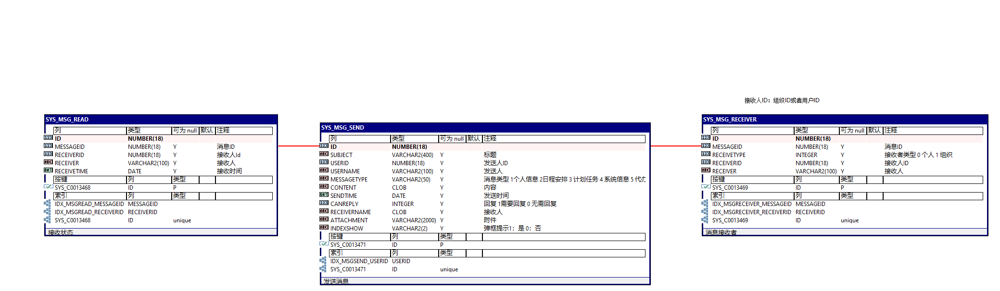
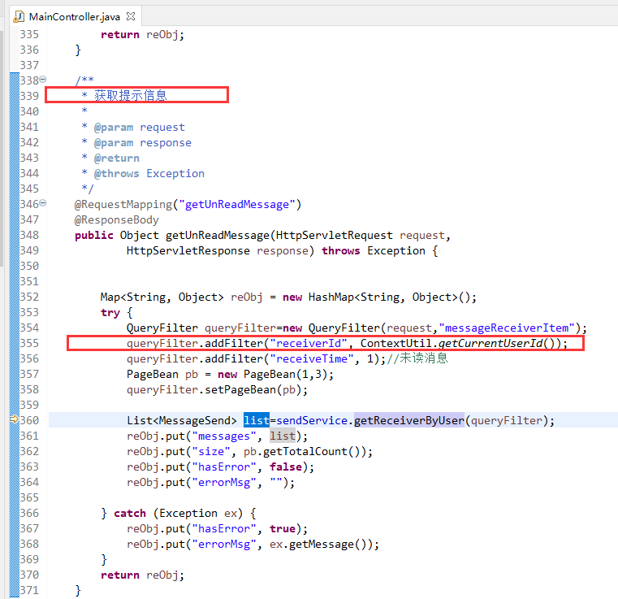
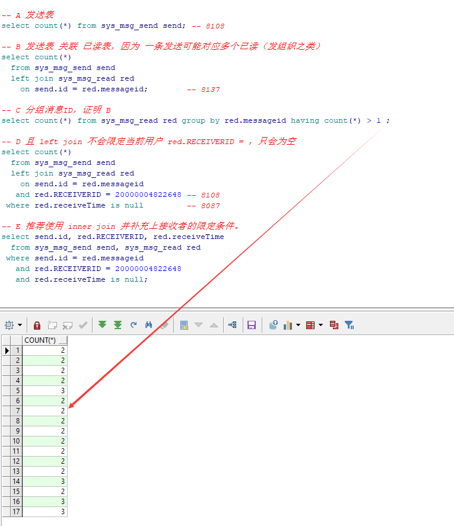
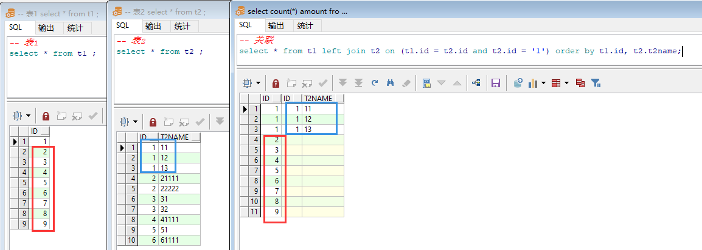

## 20210724 系统消息

### 一、错误以为 left join 会过滤数据。

SYS_MSG_SEND-发送消息
SYS_MSG_RECEIVER-消息接收者
SYS_MSG_READ-接收状态

之间关联关系如下：



异常原语句如下，其中参数1、2、3都是用户ID。

```sql
select count(*) amount
  from (select send.id           id,
               send.subject      subject,
               send.userName     userName,
               send.messageType  messageType,
               send.sendTime     sendTime,
               send.canReply     canReply,
               send.receiverName receiverName,
               rece.id           rid,
               red.receivetime,
               send.attachment
          from sys_msg_send send
          left join sys_msg_read red
            on send.id = red.messageid
           and red.RECEIVERID = :1, sys_msg_receiver rece
         where send.id = rece.messageid
           and (rece.receiverId in (select orgId
                                      from SYS_USER_POS
                                     where userId = :2
                                    union all
                                    select :3
                                      from dual))
           AND red.receiveTime is null
         order by send.sendtime desc) A;
```

参看原来代码，取得当前用户未读消息。




但实际上面的语句可以没达到这样的效果，下面一步步说明。



验证试验表



### 二、a in (b union all c) 语句解释计划正常，但实际执行造成CPU飙高。（未知原因，最终拆分语句解决）

上面仅是语句问题，下面是原分析过程。

１、查看执行计划，皆走了索引，数据量少。

2、重点查看了相关表的索引，及**索引占用空间大小**。

3、拆分语句，定位到可能由粗体部分引起，

4、最终暂时传入用户ID、组织ID用来替代两个union all

```sql
(select orgId
  from SYS_USER_POS
 where userId = :2
union all
select :3
  from dual)
```

