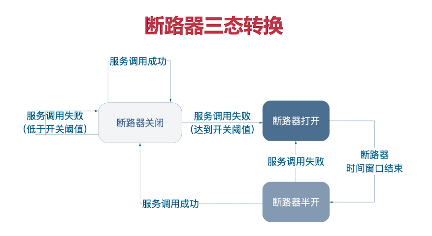

# 第1章课程介绍

## 软件与环境

- JDK8
- MySQL
- Maven

# 第2章 SpringBoot 基础

## 2-2SpringBoot是什么，能做什么？

## 2-3编写第一个SpringBoot应用

## 2-4SpringBoot应用组成分析

## 2-5SpringBoot开发三板斧

1. 添加依赖
2. 添加配置
3. 写注解

## 2-6必会：SpringBootActuator

Spring Boot includes a number of additional features to help you **monitor and manage your application** when you push it to production. You can choose to manage and monitor your application **by using HTTP endpoints or with JMX**. Auditing, health, and metrics gathering can also be automatically applied to your application.

1. 在 pom.xml 中添加依赖

```xml
<dependency>
    <groupId>org.springframework.boot</groupId>
    <artifactId>spring-boot-starter-actuator</artifactId>
</dependency>
```

2. application.yml 添加配置

   注意：* 在 YAML 必需加引号. （* has a special meaning in YAML, so be sure to add quotes if you want to include (or exclude) all endpoints.）

   安全起见，注意不要暴露到外部

   ```yaml
   management:
     endpoints:
       web:
         exposure:
           # 常见配置：health，info，metrics
           # 安全起见，注意不要暴露到外部
           include: "*"
   ```

3. 查看状态

   http://localhost:8080/actuator

   http://localhost:8080/actuator/health

   等

## 2-7必会：SpringBoot配置管理


## 2-8必会：Profile

Spring Profiles provide a way to segregate parts of your application configuration and make it be available only in certain environments. Any `@Component`, `@Configuration` or `@ConfigurationProperties` can be marked with `@Profile` to limit when it is loaded

1. 常用配置方式，下面依次优先（即覆盖）

   应用配置文件、环境变量、外部配置文件、命令行参数

2. 应用配置文件，通过 application-XXX.yml 来区分模块

   ```yaml
   spring:
     profiles:
       # 表示将加载 application-dev.yml, application-db.yml
       active: dev,db
   ```

   查看日志输出哪些配置生效

   ```shell
   The following profiles are active: dev
   ```

   

3. 环境变量

   idea，运行，配置环境变量。

4. 外部配置文件

   放置到 xxx.jar 同级目录的配置文件。

5. 命令行参数

   通过添加到命令行中，如 `--server.port=8081` 

   

# 第3章微服务的拆分与编写

## 单体架构

优点

- 架构简单
- 开发、测试、部署方便

缺点

- 复杂性高（代码越来越多）
- 部署慢，频率低（打包慢）
- 扩展能力受限
- 阻碍技术创新

## 微服务拆分

### 业界流行的拆分方法论

- 领域驱动设计（**D**omain **D**riven **D**esign）（DDD 对要解决的问题进行建模，用统一的语言沟通如UML，强调重视设计、建模，充血模型，《领域驱动设计》、《实践领域驱动设计》）
- 面向对象（by name. / by verb.）

- 职责划分
- 通用性划分

### 合理的粒度

- 良好地满足业务
- 幸福感（团队没人认为微服务太大、难以维护，同时部署高效）
- 增量迭代（相对独立）
- 持续进化（不影响某个微服务的技术选型）

### 项目的技术选型

### 工程结构规划图

com.jett.xxxxx                             模块
com.jett.xxxxx.configuration       存放配置类
com.jett.xxxxx.controller
com.jett.xxxxx.controller.notice
com.jett.xxxxx.controller.share
com.jett.xxxxx.controller.share.ShareController       Controller：包.模块包.功能Controller
com.jett.xxxxx.dao
com.jett.xxxxx.dao.notice
com.jett.xxxxx.dao.share
com.jett.xxxxx.dao.share.ShareMapper                      DAO：包.模块包.表名Mapper
com.jett.xxxxx.domain
com.jett.xxxxx.domain.dto               DTO：包.模块名.功能DTO
com.jett.xxxxx.domain.entity          实体：包.模块名.表名
com.jett.xxxxx.domain.enums        enums：包.模块名.功能Enum（枚举）
com.jett.xxxxx.service                       Service：表名Service
com.jett.xxxxx.XxxxxApplication     启动类：{artifactId}Application


# 第4章 SpringCloudAlibaba 介绍

## **4-1 SpringCloudAlibaba 是什么**

[spring-cloud-alibaba/README-zh.md at master · alibaba/spring-cloud-alibaba · GitHub](https://github.com/alibaba/spring-cloud-alibaba/blob/master/README-zh.md)

Spring Cloud Alibaba 致力于提供微服务开发的一站式解决方案。此项目包含开发分布式应用微服务的必需组件，方便开发者通过 Spring Cloud 编程模型轻松使用这些组件来开发分布式应用服务。


## **4-2 版本与兼容性**

[版本说明 · alibaba/spring-cloud-alibaba Wiki · GitHub](https://github.com/alibaba/spring-cloud-alibaba/wiki/版本说明)

### 组件版本关系

| Spring Cloud Alibaba Version                              | Sentinel Version | Nacos Version | RocketMQ Version | Dubbo Version | Seata Version |
| --------------------------------------------------------- | ---------------- | ------------- | ---------------- | ------------- | ------------- |
| 2.2.6.RELEASE                                             | 1.8.1            | 1.4.2         | 4.4.0            | 2.7.8         | 1.3.0         |
| 2021.1 or 2.2.5.RELEASE or 2.1.4.RELEASE or 2.0.4.RELEASE | 1.8.0            | 1.4.1         | 4.4.0            | 2.7.8         | 1.3.0         |

### 毕业版本依赖关系(推荐使用)

| Spring Cloud Version    | Spring Cloud Alibaba Version | Spring Boot Version |
| ----------------------- | ---------------------------- | ------------------- |
| Spring Cloud 2020.0.1   | 2021.1                       | 2.4.2               |
| Spring Cloud Hoxton.SR9 | 2.2.6.RELEASE                | 2.3.2.RELEASE       |

# 第6章实现负载均衡-Ribbon

## 负载均衡分类

服务端侧、客户端侧

## Ribbon 的基本应用

1. 添加依赖：ribbon

2. 改写 `RestTemplate` 的Bean，添加 `@LoadBalanced` 注解

   ```java
   @Configuration
   public class RestTemplateConfig {
       @Bean
       @LoadBalanced
       public RestTemplate restTemplate(@Qualifier("simpleClientHttpRequestFactory") ClientHttpRequestFactory requestFactory) {
           return new RestTemplate(requestFactory);
       }
   }
   ```

3. 调用处，只需写 

   ```java
   User user = restTemplate.getForObject("http://user-center/user/{id}", User.class, userId);
   ```

## Ribbon 的配置

## 负载的轮询方式

依次轮询、随机轮询、权重、

## 6-18 现有架构存在的问题

1. 代码可读性差
2. 复杂的URL难以维护
3. 难以响应需求的变化
4. 编程体验不统一

```java
User user = restTemplate.getForObject("http://user-center/user/{id}", User.class, userId);
```

# 第7章声明式HTTP客户端-Feign

基本使用

1. 引用依赖，如果版本冲突的话，可除去

   ```yaml
           <dependency>
               <groupId>com.alibaba.cloud</groupId>
               <artifactId>spring-cloud-starter-alibaba-nacos-discovery</artifactId>
   <!--            <exclusions>-->
   <!--                <exclusion>-->
   <!--                    <groupId>org.springframework.cloud</groupId>-->
   <!--                    <artifactId>spring-cloud-starter-netflix-ribbon</artifactId>-->
   <!--                </exclusion>-->
   <!--            </exclusions>-->
           </dependency>
           <dependency>
               <groupId>org.springframework.cloud</groupId>
               <artifactId>spring-cloud-starter-openfeign</artifactId>
           </dependency>
           <dependency>
               <groupId>org.springframework.cloud</groupId>
               <artifactId>spring-cloud-starter-loadbalancer</artifactId>
           </dependency>
   ```

2. 配置

3. 注解

   ```java
   @FeignClient(name = "user-center")        // 这里提服务名，即spring.application.name
   public interface UserCenterFeignClient {
       @GetMapping("/user/{id}")
       User findByIdOpenFeign(@PathVariable(value = "id") Integer id);
   }
   ```

# 第8章服务容错-Sentinel

## 什么是雪崩效应（Cascading failure）

任意服务提供者的不可用会导致整个依赖链的崩溃。

1. 服务提供者不可用（硬件、BUG、缓存击穿、并发）
2. 调用者堵塞
3. 调用者重试
4. 调用者不可用
5. 雪崩形成

## 应对策略

- 超时

- 限流

- [仓壁模式](https://en.wikipedia.org/wiki/Bulkhead (partition)
  )

- 断路器模式 - [CircuitBreaker (martinfowler.com)](https://martinfowler.com/bliki/CircuitBreaker.html)




# 第12章配置管理-Nacos

[Nacos Spring Cloud 快速开始](https://nacos.io/zh-cn/docs/quick-start-spring-cloud.html) - 查看【配置管理】一节

`dataId` 的完整格式如下：

```yaml
${prefix}-${spring.profiles.active}.${file-extension}
```

几条意见

1. 配置尽量放本地，不放远程（排查定位问题）
2. 尽量规避优先级。（避免多做优化级的考虑，简化配置）
3. 定规范，配置属性尽量加上注解


# [第10章API网关-SpringCloudGateway](https://docs.spring.io/spring-cloud-gateway/docs/2.2.9.RELEASE/reference/html/)

微服务网关是微服务架构中的一个关键的角色，用来保护、增强和控制对于微服务的访问，微服务网关是一个处于应用程序或服务之前的系统，用来管理授权、访问控制和流量限制等，这样微服务就会被微服务网关保护起来，对所有的调用者透明。因此，隐藏在微服务网关后面的业务系统就可以更加专注于业务本身。


## 核心概念

- Route (路由)
  Spring Cloud Gateway的基础元素,可简单理解成一条转发的规则。
  包含: ID、目标URL、Predicate集合以及Filter集合。
- Predicate (谓词)
  即java.util.function.Predicate , Spring Cloud Gateway使用Predicate实现路由的匹配条件。
- Filter (过滤器)
  修改请求以及响应

## 配置方法

- 引入依赖

```xml
<dependency>
    <groupId>org.springframework.cloud</groupId>
    <artifactId>spring-cloud-starter-gateway</artifactId>
</dependency>

<!-- 让 gateway 通过服务发现组件找到其它微服务-->
<dependency>
    <groupId>com.alibaba.cloud</groupId>
    <artifactId>spring-cloud-starter-alibaba-nacos-discovery</artifactId>
</dependency>
```

- 配置文件

```yaml
# 网关的服务端口
server:
    port: 8040

spring:
    application:
        name: gateway
    cloud:
        nacos:
            discovery:
                server-addr: 'localhost:8848'
        gateway:
          discovery:
            locator:
                # 让 gateway 通过服务发现组件找到其它微服务
                enabled: true
```

## How it works


Client：客户端

Mapping：是否匹配路径

Handler：读取过滤器

Filter：过滤器

Proxied Service：被代理的服务器

REF：[Spring Cloud Gateway](https://docs.spring.io/spring-cloud-gateway/docs/2.2.9.RELEASE/reference/html/#gateway-how-it-works)


## 配置项示例

```yaml
spring:
  cloud:
    gateway:
      routes:
      - id: after_route           # 唯一标识
        uri: https://example.org  # 最终目标
        predicates:
          - Path: /user/1         # 路径谓词
        filters:
          - oo=xx                 # 过滤器设置
```

