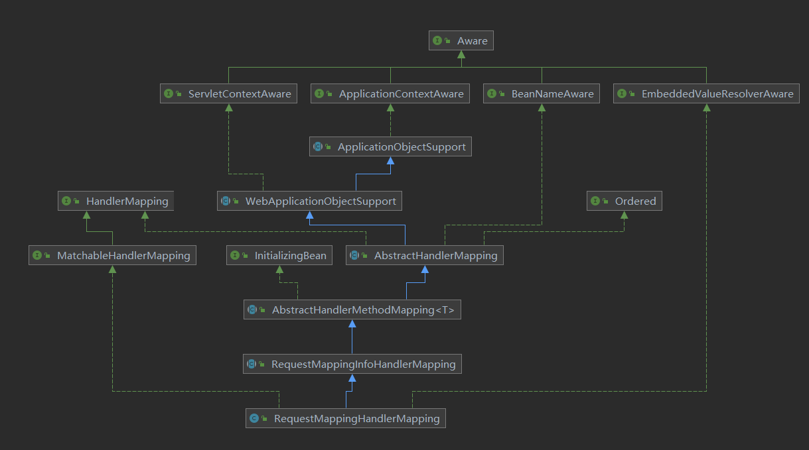
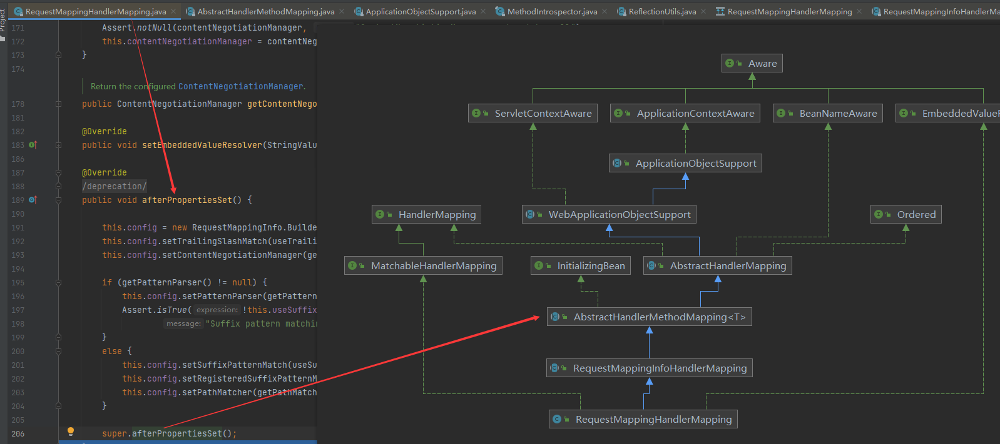
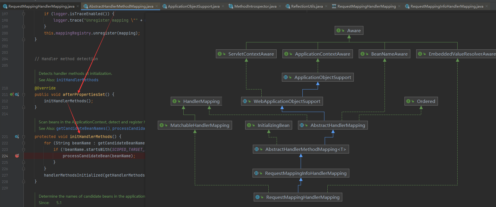
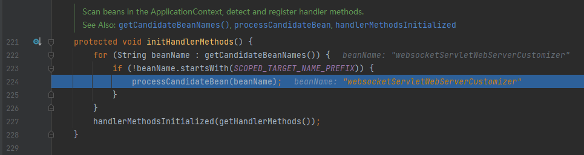
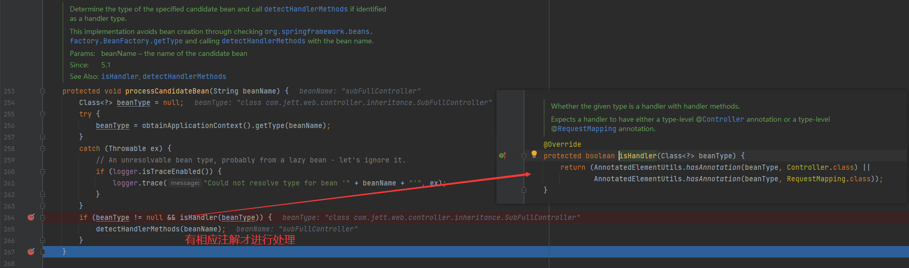
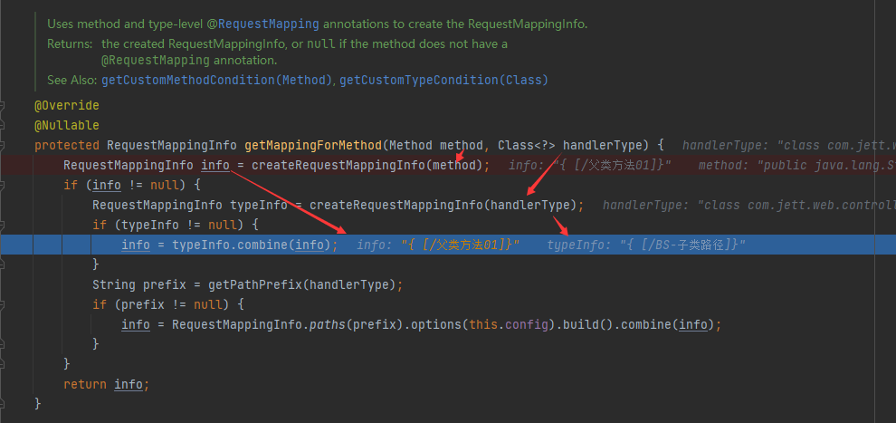
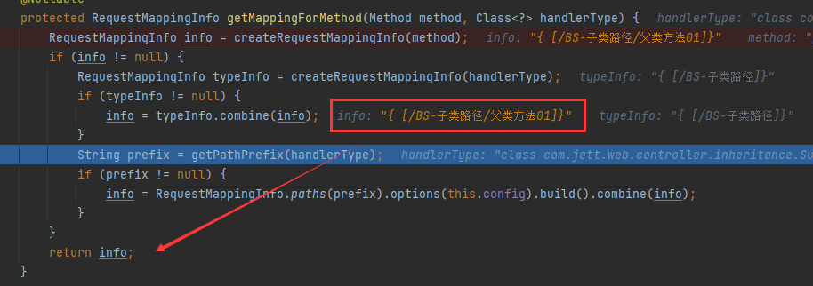
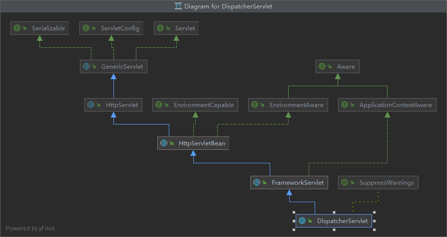
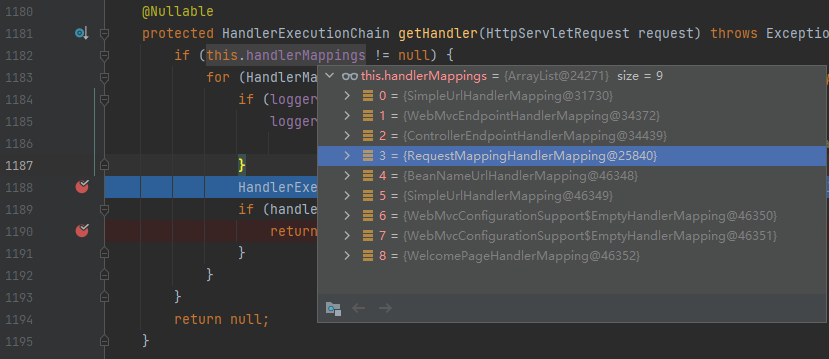

# Mapping路径源码分析

------

总体类继承图
重点：RequestMappingHandlerMapping



RequestMappingHandlerMapping.afterPropertiesSet() 覆写父类 AbstractHandlerMethodMapping。





```java
AbstractHandlerMethodMapping.processCandidateBean();
```



```java
AbstractHandlerMethodMapping.processCandidateBean();
AbstractHandlerMethodMapping.detectHandlerMethods(Object handler);
```




```java
RequestMappingHandlerMapping.getMappingForMethod(Method method, Class<?> handlerType);
```

整合类路径与方法路径
如下图 类路径 = handlerType->typeInfo，方法路径 = method->info






------

下面暂时无用



```java
// 入口
protected void doDispatch(HttpServletRequest request, HttpServletResponse response) throws Exception

// 取得处理类 
protected HandlerExecutionChain getHandler(HttpServletRequest request) throws Exception {
    if (this.handlerMappings != null) {
        for (HandlerMapping hm : this.handlerMappings) {
            if (logger.isTraceEnabled()) {
                logger.trace(
                    "Testing handler map [" + hm + "] in DispatcherServlet with name '" + getServletName() + "'");
            }
            HandlerExecutionChain handler = hm.getHandler(request);
            if (handler != null) {
                return handler; // 当前是 RequestMappingHandlerMapping 这个类取得
            }
        }
    }
    return null;
}
```

