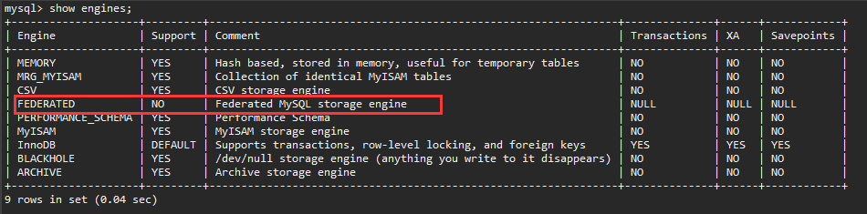
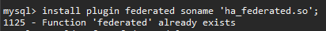
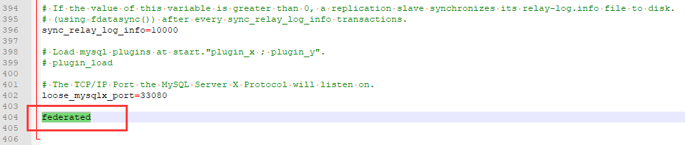

# MySQL - federated引擎应用

## 适用场景

> FEDERATED存储引擎访问在远程数据库的表中的数据，而不是本地的表。这个特性给某些开发应用带来了便利，你可以直接在本地构建一个federated表来连接远程数据表，配置好了之后本地表的数据可以直接跟远程数据表同步。实际上这个引擎里面是不真实存放数据的，所需要的数据都是连接到其他MySQL服务器上获取。

## 一、来源端：创建表、授权

**1、创建表**

略；


**2、授权**

```sql
GRANT ALL PRIVILEGES ON 来源库.来源表 TO 访问用户名 IDENTIFIED BY '密码';
GRANT ALL PRIVILEGES ON 来源库.来源表 TO  访问用户名@来源IP IDENTIFIED BY '密码';
SHOW GRANTS FOR 访问用户名;
```


## 二、访问端：安装federated存储引擎、创建连接表

**1、安装federated存储引擎**

检查是否已安装，support为no表示未支持。

```sql
mysql> show engines;
```




安装引擎

```sql
mysql> install plugin federated soname 'ha_federated.so';
```

如果提示 **1125 - Function 'federated' already exists**，则已存在但未启用。




修改配置文件

"C:\\ProgramData\\MySQL\\MySQL Server 8.0\\my.ini"

节点 **\[mysqld\]** 下

如无则在最后补充一行。

```ini
federated
```




**2、创建连接表**

```sql
CREATE TABLE `表名` (
  ……
) ENGINE=FEDERATED
DEFAULT CHARSET=UTF8
CONNECTION='mysql://目标访问账户:目标访问密码@目标IP:端口/schema/table_name';
```

指定引擎为FEDERATED，Connection为连接到目标的信息。

示例

```sql
CREATE TABLE `tb_jk_sjtbjk_source` (
  `ID` varchar(32)  NOT NULL COMMENT '主键',
  `CLDM` varchar(20)  NOT NULL COMMENT '数据同步策略代码(同步目的地)',
  `JGLY` varchar(20)  NOT NULL COMMENT '机构来源(同步来源地)',
  `SERVICE` varchar(20)  NOT NULL COMMENT '服务代码',
  `JYRQ` varchar(20)  NOT NULL COMMENT '交易日期',
  `JYSJ` varchar(20)  NOT NULL COMMENT '交易时间',
  `TBFS` varchar(1)  NOT NULL COMMENT '同步方式(0默认sql方式,1数据内容)',
  `CLBZ` varchar(1)  NOT NULL COMMENT '处理标识(默认0未处理，1已处理)',
  `BGDZ` varchar(1)  DEFAULT NULL COMMENT '变更动作(默认0新增、1修改、2删除)',
  `BGZJ` varchar(255)  DEFAULT NULL COMMENT '变更主键(key或自定义信息)',
  `BGBM` varchar(100)  DEFAULT NULL COMMENT '变更表名',
  `CONTENTS` longtext  COMMENT '交易内容',
  `CJSJ` varchar(20)  NOT NULL COMMENT '创建时间',
  `GXSJ` varchar(20)  NOT NULL COMMENT '更新时间(下次执行时间)',
  `BATCH` varchar(32)  DEFAULT NULL COMMENT '执行批次',
  `ZXCS` decimal(9,0) DEFAULT NULL COMMENT '执行次数',
  `ZXXX` varchar(255)  DEFAULT NULL COMMENT '执行信息',
  PRIMARY KEY (`ID`)
) ENGINE=FEDERATED DEFAULT ROW_FORMAT=DYNAMIC CONNECTION='mysql://root:密码@IP:3306/cyfcportal/tb_jk_sjtbjk';
```


## 注意事项

1.对本地虚拟表的结构修改，并不会修改远程表的结构

2.truncate 命令，会清除远程表数据

3. drop命令只会删除虚拟表，并不会删除远程表

4.  不支持 alter table 命令

## 目前使用federated 最大的缺点： 

1. select count(\*), select \* from limit M, N 等语句执行效率非常低，数据量较大时存在很严重的问题，但是按主键或索引列查询，则很快，如以下查询就非常慢（假设 id 为主索引）

```sql
select id from db.tablea where id >100 limit 10 ;
```

而以下查询就很快：

```sql
select id from db.tablea where id >100 and id<150
```

2.  如果虚拟虚拟表中字段未建立索引，而实体表中为此字段建立了索引，此种情况下，性能也相当差。但是当给虚拟表建立索引后，性能恢复正常。

3. 类似 where name like "str%" limit 1 的查询，即使在 name 列上创建了索引，也会导致查询过慢，是因为federated引擎会将所有满足条件的记录读取到本，

再进行 limit 处理。

这几个问题已经严重影响了federated 在实际环境中的应用，所以这个引擎很冷门，不过在一些特定环境还是能用的。


> REF：
>
> https://blog.csdn.net/commasx/article/details/87284878
>
> https://www.cnblogs.com/chenglee/p/9567248.html

