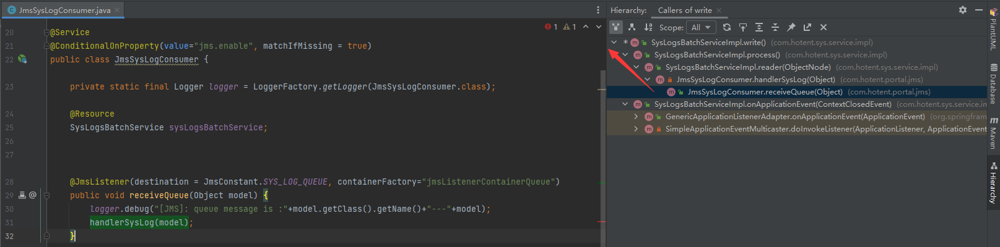
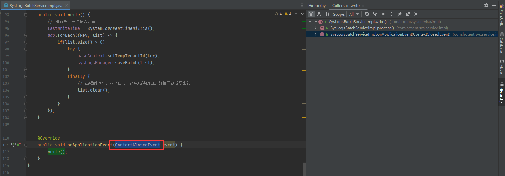

# 日志记录


## 产生

通过spring切面拦截请求，并推送到mq中

```java
@Aspect
@Component
public class SysLogsAspect {

   JmsProducer jmsProducer;

   @Around("execution(* *..*Controller.*(..)) && @annotation(io.swagger.annotations.ApiOperation)")
   public Object sysLogs(ProceedingJoinPoint joinPoint) throws Throwable{
      Class<?> targetClass = joinPoint.getTarget().getClass();
      String methodName = joinPoint.getSignature().getName();
       
      // 执行方法后
      //访问目标方法的参数：
      Object[] args = joinPoint.getArgs();
      String reqUrl = request.getRequestURI();
       
       ObjectNode objectNode = JsonUtil.getMapper().createObjectNode();
       objectNode.put("id", UniqueIdUtil.getSuid());
       objectNode.put("opeName", opeName);
       objectNode.put("moduleType", moduleType);
       ...
       jmsProducer.sendToQueue(JsonUtil.toJson(objectNode),JmsConstant.SYS_LOG_QUEUE);
       
       return proceed;
   }
}
```

## 保存

海量日志内容如何记录？

先保存到MQ中，并从MQ中取得日志内容。

1、正常根据【待插入记录超限 或者 最大等待时间到期】写入数据库。



2、考虑到应用关闭情况下写入数据库。

```java
ContextClosedEvent
```


