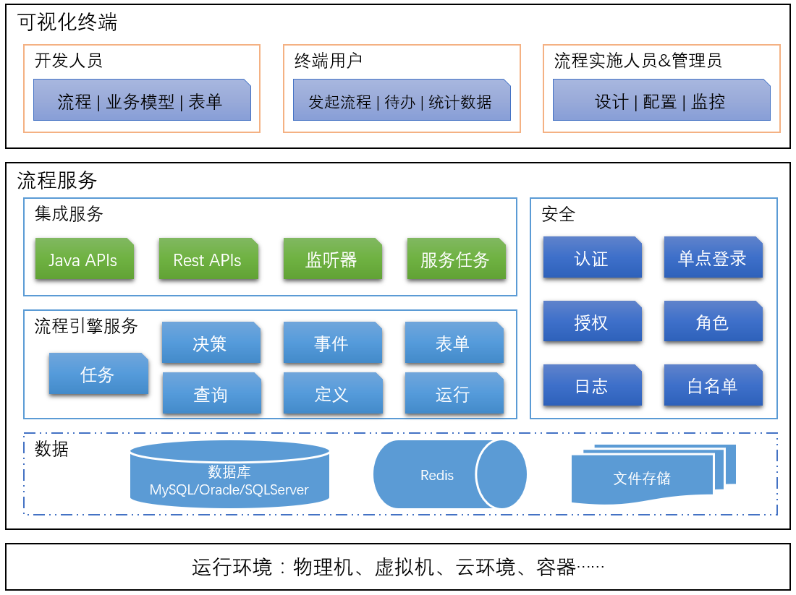

# 产业扶持

## S4门户

## X7产品定位

[Hotent宏天软件 | BPM-工作流-流程引擎-activiti-开源工作流-快速开发平台-微服务架构-可视化流程设计-流程审批 (jee-soft.cn)](https://www.jee-soft.cn/)

流程中心（流程集中式管理、统一的用户组织、待办、消息）、集成门户（删除）、开发平台（删除）

扶持产品的定位？

## 技术特点

补充：微服务、前后端分离（SpringBoot、MP、Vue2、FreeMarker、）、中间件（Ngx、Redis、MQ、DB、FTP、IM、Solr、）

流程、表单、门户、用户中心

## 集成

用户集成

​	数据同步：job同步数据库、考虑增量情况（优点：实现容易、快速、）

​	更换接口实现：实现uc-api-imp

登陆集成

​	Cas单点登录

​	Oauth单点登录

​	LDAP统一认证

流程集成

​	业务对象集成：用于外系统将业务数据以json形式传到X7中。

​	 外部表集成：直接读取外系统表记录。

​	URL表单集成：（流程处配置）

REF：http://120.79.171.153:3699/svn/ProjectSVN/108_产业扶持产品化建设/07参考资料/01宏天工作流平台培训视频/EIPSAAS_开发培训.wmv