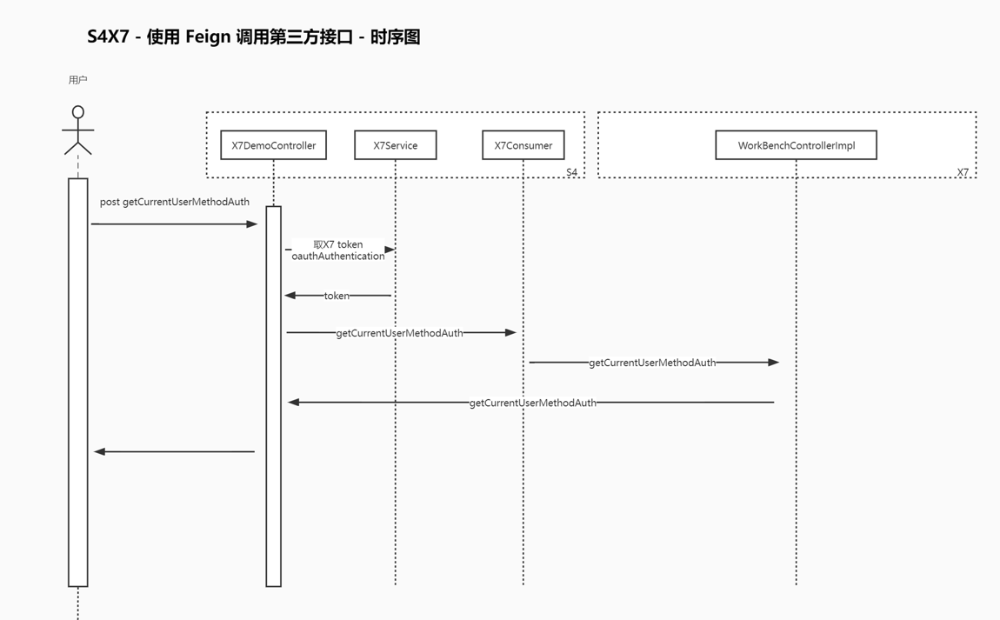

# 接口透传

### 一、背景

为方便快速在不同应用之间相互调用。

### 二、OpenFeign是什么？

`OpenFeign`是一个声明式的`web服务客户端`，让编写web服务客户端变的非常容易，只需要创建一个接口并在接口上添加注解即可，openFeign的前身是Feign，后者目前已经停更了，openFeign是SpringCloud在Feign的基础上支持了Spring MVC的注解，并通过动态代理的方式产生实现类来做负载均衡并进行调用其他服务。

### 三、实现



#### 程序依赖

```xml
<dependency>
    <groupId>org.springframework.cloud</groupId>
    <artifactId>spring-cloud-starter-openfeign</artifactId>
</dependency>
<dependency>
    <groupId>io.github.openfeign.form</groupId>
    <artifactId>feign-form</artifactId>
</dependency>
<dependency>
    <groupId>io.github.openfeign.form</groupId>
    <artifactId>feign-form-spring</artifactId>
</dependency>
```

#### 接口配置


> 因为未使用注册中心，这里直接配置

#### 服务调用


> 如果要调用服务的话，我们只需要使用`@Resource`或者`@Autowired`注解来引入之前我们添加的注册接口，然后要调用服务的时候，调用该接口即可。