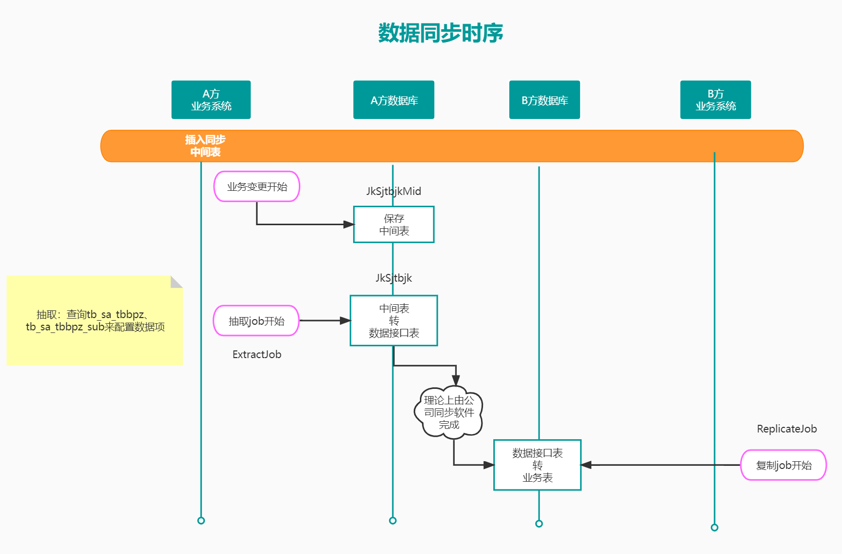
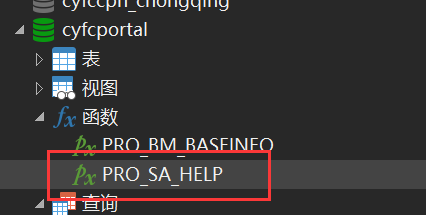
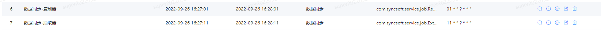
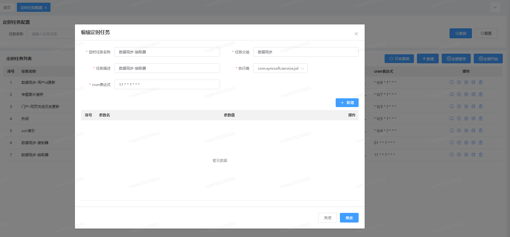
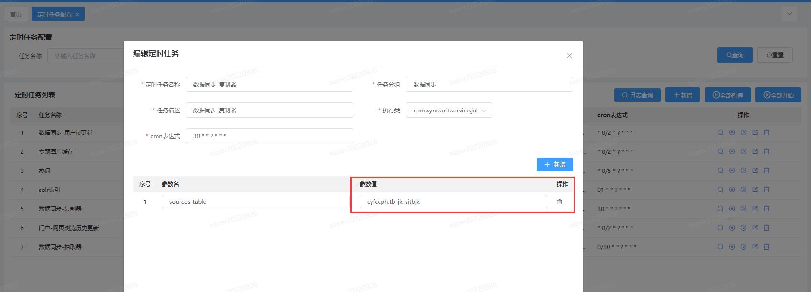
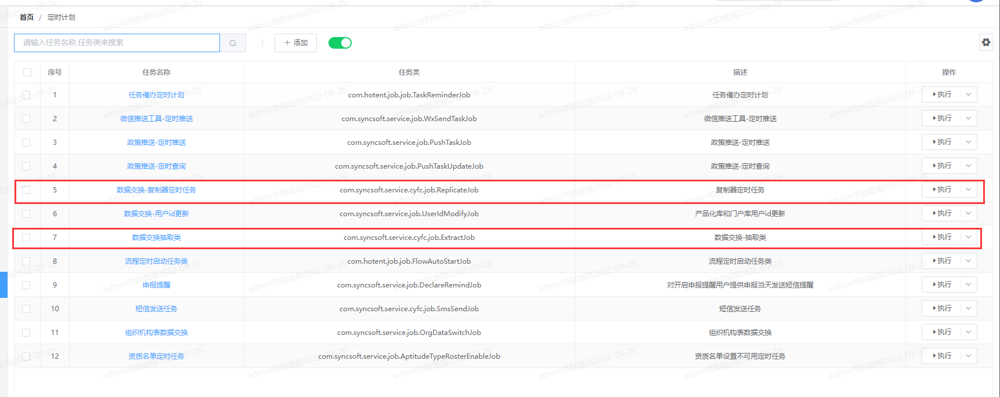

# 数据交换

## 一、背景

因为项目成立之初，使用两种不同架构（SyncCloud4下面简称S4，eipsaas_x7下面简称X7）并分别有各自的库表。考虑到库表后续实际生产中分享的问题，且业务中有两库数据相互同步的情况，需要进行数据交换。

### 二、实现方案

公司现有方案：SyncSwitch数据交换平台

数据库级别交换方案：GoldenGate（仅适用于Oracle）、Binlog（MySQL）

最终实现由团队确认为内部实现。

参考文件：http://svn.syncsoft.com:3699/svn/ProjectSVN/108_产业扶持产品化建设/07参考资料/数据交换/其他相关文档/

    dblink同步.txt
    GoldenGate基本原理、安装过程和基本维护.doc
    SharedSwitchService.java
    Switch.txt
    SyncSwitch数据交换平台业务系统接口设计.v1.1.doc
    SyncSwitch数据交换平台交换策略设计.v2.1.doc
    SyncSwitch数据交换平台交易报文技术规范.v1.1.1.doc
    SyncSwitch数据交换平台产品白皮书.v1.0.doc
    SyncSwitch数据交换平台架构设计.v1.1.pptx
    交换讨论整理.xlsx
    单位端共享版GoldenGate配置(项目组).docx
    厦门市非税收入管理信息系统_新数据交换配置手册.docx
    数据交换DBLink.vsdx
    数据交换组件配置说明.docx
    杭州数据交换操作手册3.0.docx

### 三、数据同步时序



### 四、数据交换配置相关


1. 数据库基础配置

   MySQL环境不同实例见《使用federated实现远程表访问(类似dblink).pdf》，相同实例配置用户之前可访问对方tb_jk_sjtbjk即可。

2. 配置数据同步表及同步表明细

   语句存放于 

   ```sql
   select * from tb_sa_tbbpz     t where t.YBM = 'tb_bpm_definition_ext' ;
   
   select * from tb_sa_tbbpz_sub s where s.TBBPZ_ID  = (select id from tb_sa_tbbpz     t where t.YBM = 'tb_bpm_definition_ext' );
   
   
   select * from information_schema.`TABLES` t where 
       t.TABLE_SCHEMA = 'cyfccph' -- 用户
   and t.TABLE_NAME like 'tb_bpm_definition_ext' ;
   
   -- 插入 表配置，需要手动改的就是 【原表的主键字段】、【目标表的主键字段】
   INSERT INTO `cyfccph`.`tb_sa_tbbpz` (`ID`, `YBM`, `YBZWM`, `YBZJ`, `MBBM`,
          `MBBZWM`, `MBBZJ`, `VALIDFLAG`) 
   select t.TABLE_NAME id, t.TABLE_NAME ybm, t.TABLE_COMMENT ybzwm, 'id' ybzj, t.TABLE_NAME mbbm,
          t.TABLE_COMMENT mbbzwm, 'id' mbbzj, '1' VALIDFLAG
     from information_schema. TABLES t
    where t.TABLE_SCHEMA = 'cyfccph'                -- 用户
      and t.TABLE_NAME like 'tb_bpm_definition_ext' -- 新表名
   ;
   
   -- 插入 表字段配置
   INSERT INTO `cyfccph`.`tb_sa_tbbpz_sub` (`ID`, `YBZD`, `MBBZD`, `TBBPZ_ID`, `VALIDFLAG`, `TAR_COL_TYPE`) 
   select replace(uuid(), '-', '') id, c.COLUMN_NAME, c.COLUMN_NAME, c.TABLE_NAME, '1'
          ,if((LOWER(c.DATA_TYPE)='datetime' or LOWER(c.DATA_TYPE)='clob' or LOWER(c.DATA_TYPE)='blob'), c.DATA_TYPE, null) DATA_TYPE
     from information_schema.`COLUMNS` c
    where c.TABLE_SCHEMA = 'cyfccph'             -- 用户
      and c.TABLE_NAME = 'tb_bpm_definition_ext' -- 新表名
    order by c.ordinal_position
   ;
   ```

   

3. 相关业务代码

   ```java
   // 引入同步Service
   @Resource
   DataSwitch dataSwitch;
   
   // 在数据变更处理插入同步逻辑，详细参数见原函数说明。
   dataSwitch.dataSwitch(DataSwitch.BGDZ_ADD, DataSwitchView.V_TB_PORTAL_PROJECT, 业务变更表主键值);
   ```

   

4. 定时任务配置

   

   

   S4配置抽取器

   

   S4 配置复制器

   

   X7配置定时任务

   

   

   详细见《http://svn.syncsoft.com:3699/svn/ProjectSVN/108_产业扶持产品化建设/06实施运维区/02实施文档/03版本脚本信息/定时任务配置.xlsx》

   

5. 库表关系图

   ![cyfccph-DATA_TRANSFER_ER[数据交换-关系图]-2022112100044](数据交换.assets/cyfccph-DATA_TRANSFER_ER[数据交换-关系图]-2022112100044-16673545603942.png)

6. 问题排查

   Q：中间表有数据，接口表没有数据
   A：是否配置了 com.syncsoft.service.cyfc.job.ExtractJob 的定时任务。

   

   Q：中间表没有数据
   A：配置表是否正常。

   

   Q：接收表有接口来源数据，没有业务数据更新。
   A：检查接口表错误信息。

   

   Q：中间表有大量数据。
   A：当前设计中，会定时生成组织数据到中间表中，如果未及时同步会堆积大量数据。如果发生这种情况，可直接删除重复数据，仅保留最新的数据。
   加快数据同步速度。

   

   Q：未有新添加字段
   A：补充新字段描述到 `tb_sa_tbbpz_sub` 表中。
