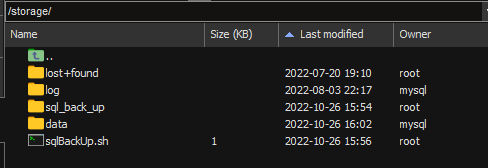

# 数据库备份说明

> 数据库作为信息系统的核心，担当者重要的角色
> 数据库备份，是在数据丢失的情况下，能及时恢复重要数据，防止数据丢失的一种重要手段
> 一个合理的数据库备份方案，能够在数据丢失时，有有效地恢复数据，而且也需要考虑技术实现难度和有效地利用资源

考虑用户环境与实施能力，采用全量备库方案。


主体目录如下：




数据文件路径：/storage/data
备份脚本路径：/storage/sqlBackUp.sh
备份文件路径：/storage/sql_back_up/
定时任务配置：crontab -e
程序路径：/usr/local/mysql


脚本说明：sqlBackUp.sh 

```shell
#!/bin/bash
cur_date=$(date +%d)
/usr/local/mysql/bin/mysqldump --defaults-extra-file=/etc/mysqldump.cnf cyfccph | gzip > /storage/sql_back_up/cyfccph_$cur_date.gz
cd /storage/sql_back_up/
ls -t | sed -n '16,$p' | xargs -I {} rm -rf {}

```

密码文件说明：mysqldump.cnf

```
[client]
host = localhost
user = root
password = '密码'
```


REF：

http://svn.syncsoft.com:3699/svn/ProjectSVN/309_荆州市惠企政策直达服务平台/06实施运维区/02实施文档/01网络拓扑图/荆州惠企云-服务器信息（包含应用）.xlsx

http://svn.syncsoft.com:3699/svn/ProjectSVN/309_荆州市惠企政策直达服务平台/06实施运维区/99-生产部署文件/数据库