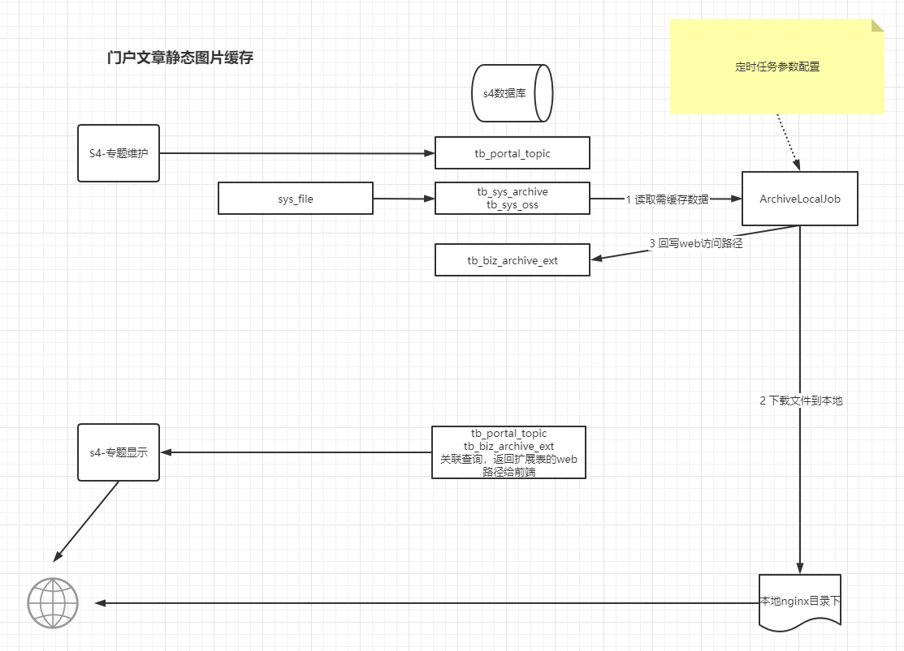
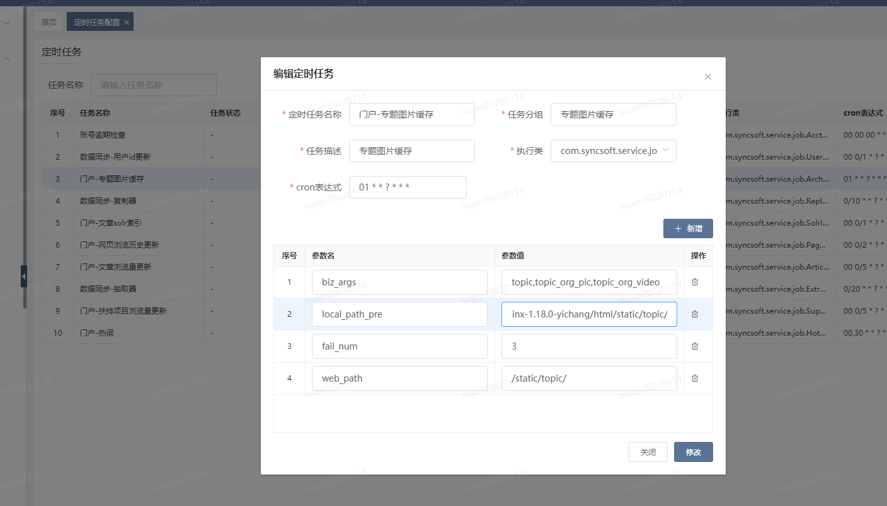

# 门户文章静态图片缓存

> 前因：因公司框架设计问题，文档及图片等二进制文件皆通过后端应用中转，考虑到门户前端是面向广大群众，需要面对并发及加载效率问题，且当时项目紧急，所以针对这一情况设计出缓存文件的方案。

### 概览

### 要点

1、由业务系统（当前仅有）专题文章功能写入附件信息

2、缓存定时任务读取附件表信息，根据配置项过滤出需要缓存的记录。

3、将读取的记录去FileRepository取出文件并存到本地目录中（一般是对应nginx目录）

### 定时任务编辑界面

#### 定时任务配置项：

biz_args:topic,topic_org_pic,topic_org_video
local_path_pre:E:/cqcyfc/nginx-1.18.0/html/static/topic或者/usr/local/nginx/html/static/topic，根据实际路径配置以/作路径分隔符
web_path:/static/topic，web访问前缀
fail_num:3

#### 排查方法

TODO 待补充